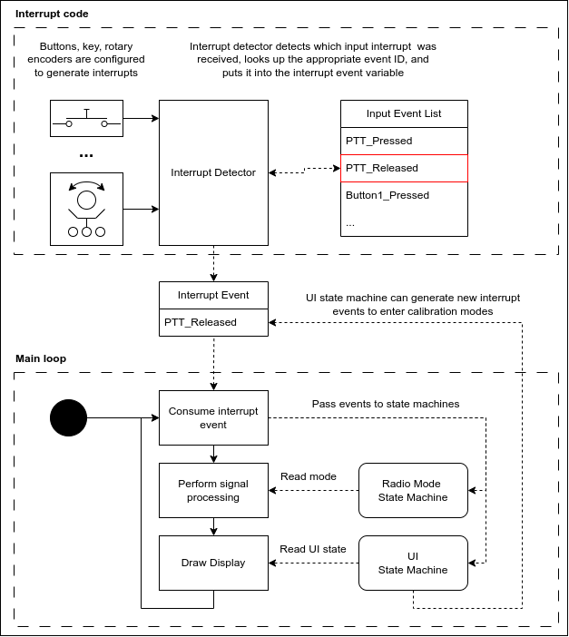
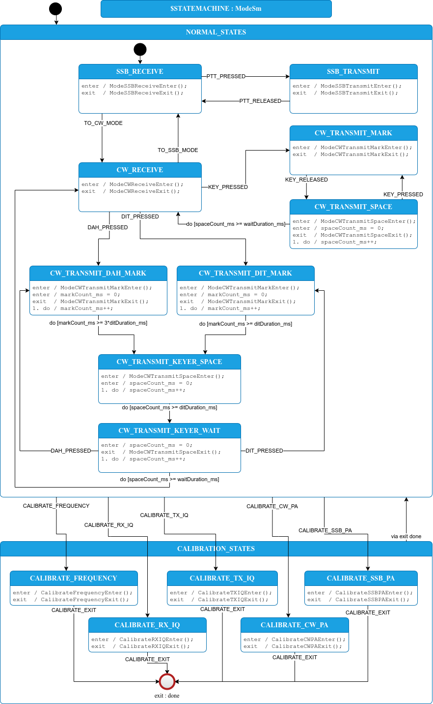

## Software overview

The software runs in a loop as shown in the diagram below. It performs three major functions:

1. Handle interrupt events: if an interrupt was registered by, for example, a button being pressed, then pass the appropriate event on to the state machines (more on these later).
2. Perform the appropriate signal processing, based on the current radio mode.
3. Update the display, based on the current UI state.

Then go back to step 1 and repeat. This loop should take at most 10ms to execute in order to avoid buffer overflows in the audio processing software.

### Handling button presses

We don't want button presses to change the hardware state at random, unspecified times. In order to control the timing of when we respond to button presses, we attach the buttons to interrupts that set an interrupt event register. This register is checked and cleared only once in the main loop. 

### State machines

The state of the radio hardware is controlled by a radio mode state machine. This is the only place in the code where the hardware state is changed. Using a state machine to control the hardware ensures that all hardware is always in a known configuration state.

Similarly, we use a (different) state machine to control the user display. This helps to logically separate the display from the rest of the radio operation, making it more portable and extensible.

State machines can be written entirely in C code, but it's easier to understand how the state machine operates through a drawing. We draw the state machines in a graphical environment and then generate the C code that implements the state machine using [StateSmith](https://github.com/StateSmith/StateSmith). The state machine shown above is an example of this.

## Build environment

### Arduino

### StateSmith

[StateSmith](https://github.com/StateSmith/StateSmith) is used to generate state machine code from UML diagrams. The diagrams are drawn in draw.io, a graphical diagram editor. draw.io is available in an online version and a desktop version; use the Desktop version which you can download [here](https://www.drawio.com/).

Install the StateSmith binary using [these](https://github.com/StateSmith/StateSmith/wiki/CLI:-Download-or-Install) instructions. For simplicity, we recommend using the pre-built binaries rather than building it from source.

### Google Test

The test framework isn't needed to compile and run the code. If you want to modify the code, using the test framework is highly recommended as it will help you discover when your changes break the code.

The Test Driven Development framework we use is [Google Test](https://google.github.io/googletest/). You don't need to install it -- it is downloaded as part of the make process. You need to have [cmake](https://cmake.org/download/) installed.

