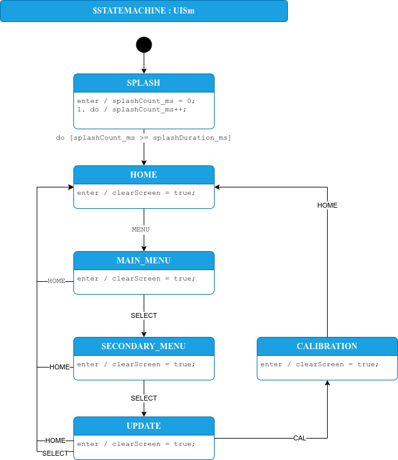

# This repository

This is a preview of a new software approach, called Phoenix, for the T41-EP radio running V12 hardware. It is missing calibration routines and hardware SSB transmit is not yet enabled. Receive should be working correctly. 

It is a ground-up rewrite of the T41 software, which has been authored by dozens of people over the years. I have listed the known authors that left their call signs in the code in the file `code/Contributors.txt` -- please let me know if I've missed anyone!

# T41-EP overview

The T41-EP Software Defined Transceiver (SDT), originally designed by Al Peter-AC8GY and Jack Purdum-W8TEE, is a 20W, HF, 7 band, CW/SSB Software Defined Transceiver (SDT) with features like 192kHz spectrum display bandwidth, ALP CW decoder, Bode Plots. The T41-EP is a self-contain SDT that does not require an external PC, laptop, or tablet to use. Al and Jack wrote a book, available on [Amazon](https://www.amazon.com/Digital-Signal-Processing-Software-Defined/dp/B0F5BDQZW3), describing the theory and operation of the T41-EP. Al has made a website describing the radio [here](https://t41sdrtransceiver.wordpress.com/). A block diagram of the V12 radio hardware is shown below.


# Architecture overview

Phoenix SDR is built around a state machine-driven architecture that ensures deterministic hardware control. Events like button presses, CAT commands, or encoder turns are placed in an interrupt buffer and handled at a predictable point in the code, preventing state corruption. The code implements hardware abstraction for testability and modularity.

1. **Separation of Concerns**: Hardware control, signal processing, and display are isolated into separate modules with clear interfaces. Hardware interfaces (RFBoard, LPFBoard, BPFBoard) provide clean APIs, allowing mocking for unit tests.
2. **State Machine Control**: All hardware state changes flow through state machines (ModeSm, UISm, TuneSm) ensuring deterministic, predictable behavior.
3. **Separated Display**: Display code is separated from the rest of code and reads the global state but never modifies it. As a demonstration of the display code separation, it can be disabled by commenting out a single line in `loop()` and the radio can operate without the display.
4. **Testing and Debugging**: An extensive set of unit tests ensure that changes to the code don't cause unexpected subtle bugs. The test framework enables you to use software debuggers to exercise the radio code, greatly speeding up the process of finding and fixing most bugs.

## State machines

The behavior of the radio is controlled by a set of state machines. Hardware interrupts, like button presses, are handled by the main loop and used to dispatch events to the Mode and UI state machines, as well as update the shared global configuration settings. The Mode State Machine drives two further state machines: one controls the hardware state, and the other controls the frequencies of the VFOs. The architecture of the state machines is shown in the diagram below.


The state of the radio hardware is controlled by a radio mode state machine. Using a state machine to control the hardware ensures that all hardware is always in a known configuration state. The state machine UML diagram is found in the file `code/src/PhoenixSketch/ModeSm.drawio`, and is shown below.


Similarly, we use a state machine to control the user display. This helps to logically separate the display from the rest of the radio operation, making it more portable and extensible.



State machines can be written entirely in C code, but it's easier to understand how the state machine operates through a drawing. We draw the state machines in a graphical environment and then generate the C code that implements the state machine using [StateSmith](https://github.com/StateSmith/StateSmith). The state machines shown above are examples of this.

## Control flow

The software runs in a loop as shown in the diagram below. It performs three major functions:

1. Handle interrupt events: if an interrupt was registered by, for example, a button being pressed, then pass the appropriate event on to the state machines.
2. Perform the appropriate signal processing, based on the current radio mode.
3. Update the display, based on the current UI state.

Then go back to step 1 and repeat. This loop should take at most 10ms to execute in order to avoid buffer overflows in the audio processing software.


### Handling button presses

We don't want button presses to change the hardware state at random, unspecified times. In order to control the timing of when we respond to button presses, we attach the buttons to interrupts that set an interrupt event register. This register is checked and cleared only once in the main loop. 

## Remote control

The radio will provide two serial interfaces over USB. The first, at a baud rate of 115200, prints debug messages. The second, at a baud rate of 38400, implements CAT control with a partial implementation of the Kenwood TS2000 CAT Interface.

# Build environment

## Arduino

This code has been tested with the Arduino IDE version 2.3.6. Configure your Arduino IDE to use the Teensyduino library following the instructions [here](https://www.pjrc.com/teensy/td_download.html). 

Install the following libraries via the Arduino Library Manager:

* Adafruit MCP23017 Arduino Library, by Adafruit (v2.3.2) (note: install with dependencies)

Several libraries need to be installed manually. The manual process is:

1. Go to the provided GitHub link for the library and download the library as a zip by clicking Code -> Download ZIP.
2. Import it into the Arduino 2 IDE by clicking Sketch -> Include Library -> Add .ZIP library, and then selecting the file you just downloaded.

The libraries to install using this process are:

* OpenAudio: [https://github.com/chipaudette/OpenAudio_ArduinoLibrary](https://github.com/chipaudette/OpenAudio_ArduinoLibrary)


## StateSmith

[StateSmith](https://github.com/StateSmith/StateSmith) is used to generate state machine code from UML diagrams. The diagrams are drawn in draw.io, a graphical diagram editor. draw.io is available in an online version and a desktop version; use the Desktop version which you can download [here](https://www.drawio.com/).

You only need to install the StateSmith binary if you want to update the state machines. The code will compile without StateSmith installed.

Install the StateSmith binary using [these](https://github.com/StateSmith/StateSmith/wiki/CLI:-Download-or-Install) instructions. For simplicity, we recommend using the pre-built binaries rather than building it from source.

## Google Test

The test framework isn't needed to compile and run the code. If you want to modify the code, using the test framework is highly recommended as it will help you discover when your changes break the code.

The Test Driven Development framework we use is [Google Test](https://google.github.io/googletest/). You don't need to install it -- it is downloaded as part of the make process. You need to have [cmake](https://cmake.org/download/) installed. 

The first time you run the unit tests, start in the Phoenix directory and run the following command to create a build directory:

```bash
mkdir code/test/build
```

Then, to build and run the unit tests, do the following:

```bash
cd code/test/build
cmake ../ && make
ctest --output-on-failure
```

This will compile and run the unit test programs. You should see an output that looks something like this (but with all tests passed!):

```bash
...
127/131 Test #127: FrontPanel.CenterTuneIncrease ...................................   Passed    0.02 sec
        Start 128: FrontPanel.CenterTuneDecrease
128/131 Test #128: FrontPanel.CenterTuneDecrease ...................................   Passed    0.01 sec
        Start 129: FrontPanel.FineTuneIncrease
129/131 Test #129: FrontPanel.FineTuneIncrease .....................................   Passed    0.02 sec
        Start 130: FrontPanel.FineTuneDecrease
130/131 Test #130: FrontPanel.FineTuneDecrease .....................................   Passed    0.01 sec
        Start 131: FrontPanel.FineTuneLimits
131/131 Test #131: FrontPanel.FineTuneLimits .......................................   Passed    0.01 sec

98% tests passed, 2 tests failed out of 131

Total Test time (real) =   5.91 sec

The following tests FAILED:
         96 - SignalProcessing.DemodulateAM (Failed)
         97 - SignalProcessing.DemodulateSAM (Failed)
```

