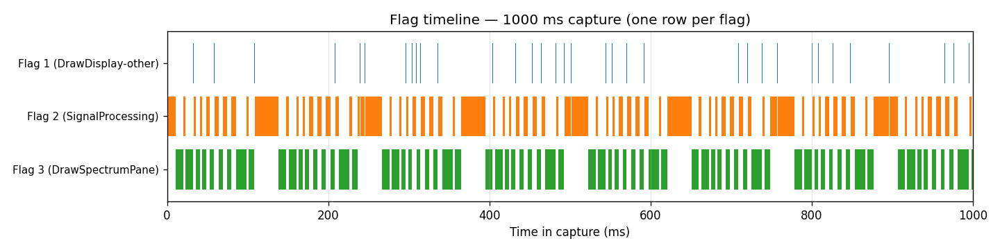
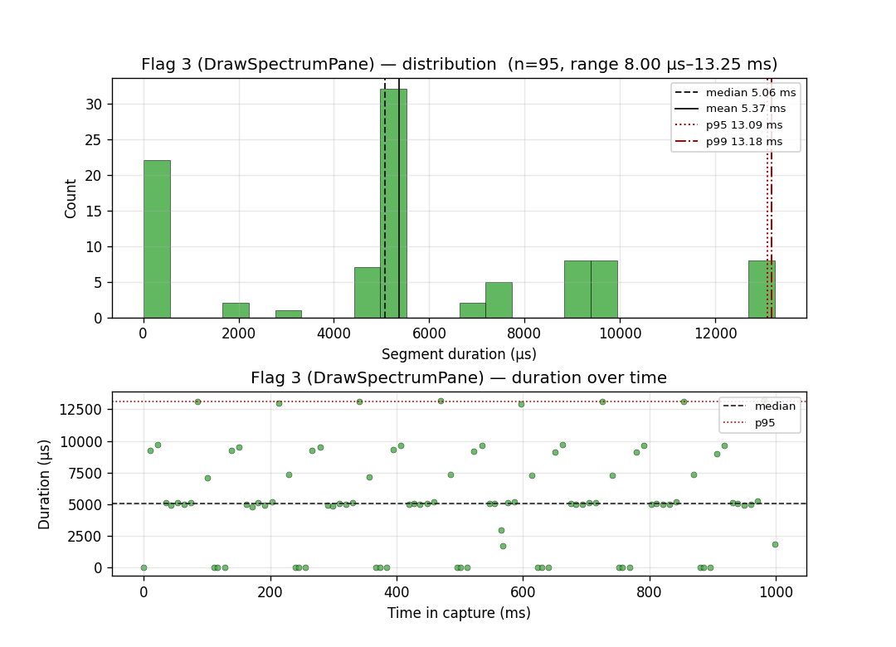
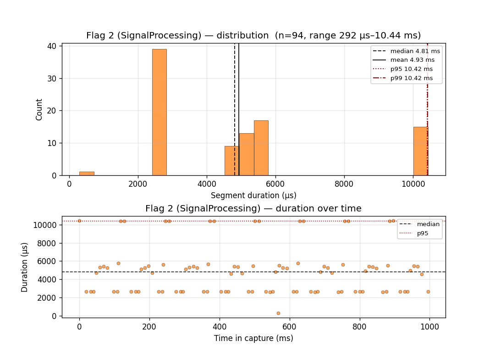
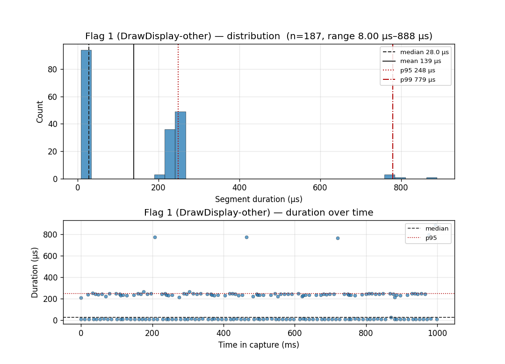
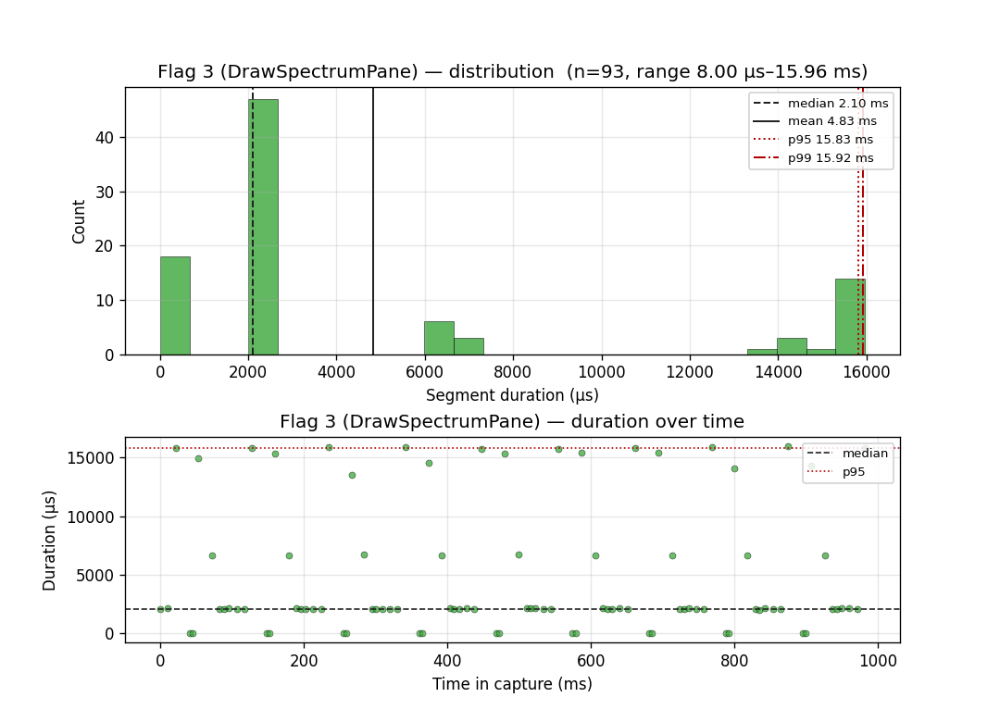
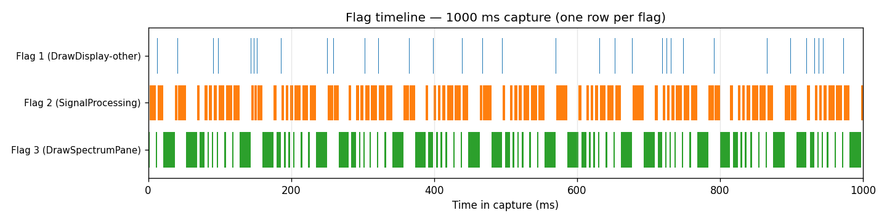

# DrawDisplay Timing Baseline

Baseline timing profile of `loop()` over 1 second, with `DrawSpectrumPane()`
bracketed by `Flag(3)`. Use this as the reference for evaluating future
changes to `DrawDisplay()` and its subfunctions.

## Capture conditions

| Field | Value |
|---|---|
| Branch | `display_timing` |
| Commit | `f479960` (+ TEMP `Flag()` instrumentation in `DrawSpectrumPane`) |
| Date | 2026-05-23 |
| Radio UI state | HOME |
| Sample rate | 250 kHz (4 µs resolution) |
| Capture duration | 1.000 s |
| Acquisition mode | record (USB streaming) |
| Trigger | `Flag(1)` (DrawDisplay entry) |
| Debounce | 8 µs (2 samples) |
| Lost samples | 0 |
| Corrupt samples | 574 (DWF advisory; no observed effect on segment counts) |

The capture was made with the firmware compiled at `opt=o1lto` and the radio
running in its default boot state.

### Instrumentation in effect

| Flag | Meaning | Source |
|---|---|---|
| `0` | Loop idle (between iterations) | `Loop.cpp` `loop()` tail |
| `1` | Inside `DrawDisplay()` — everything except `DrawSpectrumPane` | `Loop.cpp` (entry), `MainBoard_DisplayHome.cpp` `DrawSpectrumPane()` exit (TEMP) |
| `2` | `PerformSignalProcessing()` | `Loop.cpp` |
| `3` | Inside `DrawSpectrumPane()` (includes `DrawFrequencyBarValue`, `DrawBandWidthIndicatorBar`, `ShowSpectrum`, `ShowBandwidth`) | `MainBoard_DisplayHome.cpp` (TEMP) |
| `4` | Event processing | `Loop.cpp` (set, but segment swallowed by debounce — see Caveats) |

## Headline numbers

**Iteration rate**: ~95 Hz → ~10.5 ms per `loop()` iteration.

**Time budget per second (% of CPU):**

| Stage | Total time | % of CPU |
|---|---|---|
| `PerformSignalProcessing` (Flag 2) | 464 ms | 46.4 % |
| `DrawSpectrumPane` (Flag 3) | 510 ms | 51.0 % |
| Rest of `DrawDisplay` (Flag 1) | 26 ms | 2.6 % |

`DrawSpectrumPane` is the largest single consumer in `loop()` — it accounts
for over half of CPU time and is the dominant bottleneck for iteration rate.

### Overall timeline



Each row is one flag. Flag 2 (orange) and Flag 3 (green) alternate
throughout the second, with the wider green bars marking the ~13 ms
"heavy redraw" path and the wider orange bars marking the ~10 ms
double-block processing path. Flag 1 (blue, sparse) appears only at
the boundaries — the 3 visible tall ticks around 200 / 460 / 720 ms
are the ~780 µs `DrawHome`-cold-path outliers.

## Per-stage statistics (n = 1-second capture)

All times in **microseconds**. Resolution = 4 µs (one sample period).

### Flag 3 — DrawSpectrumPane

| Stat | Value (µs) |
|---|---|
| Count | 95 invocations |
| Min | 8 |
| Median | 5 064 |
| Mean | 5 371 |
| p95 | 13 093 |
| p99 | 13 180 |
| Max | 13 248 |
| Stddev | 3 887 |



**Distribution shape**: **multi-modal** — at least four distinct duration
lanes are visible in the histogram:

| Lane | Approx duration | Count | Likely path |
|---|---|---|---|
| 1 | ~8 µs (1 bin) | 22 | Early return at `MainBoard_DisplayHome.cpp:735` (`!PaneSpectrum.stale`) |
| 2 | ~5 ms | 32 | Typical waterfall + spectrum redraw (median path) |
| 3 | ~7–8 ms | 9 | Spectrum + bandwidth indicator |
| 4 | ~9–10 ms | 8 | Heavier redraw including additional sub-panes |
| 5 | ~13 ms | 8 | Slowest path — full redraw with all overlays |

The scatter plot shows the slow-lane events are **uniformly distributed**
through the 1-second window, not clustered at startup or thermal-drifting,
indicating discrete code-path branches inside `DrawSpectrumPane` rather
than a transient. Optimization should target the ~13 ms lane first: it
accounts for ~104 ms (≈ 20% of total `DrawSpectrumPane` time) from only
8 invocations.

### Flag 2 — PerformSignalProcessing

| Stat | Value (µs) |
|---|---|
| Count | 94 invocations |
| Min | 292 |
| Median | 4 812 |
| Mean | 4 934 |
| p95 | 10 416 |
| p99 | 10 421 |
| Max | 10 440 |
| Stddev | 2 700 |



Three-lane structure:

| Lane | Approx duration | Count | Likely path |
|---|---|---|---|
| 1 | ~2.7 ms | 39 | One audio block ready — typical |
| 2 | ~5–5.5 ms | 39 | Slightly heavier processing path |
| 3 | ~10.4 ms | 15 | Two audio blocks back-to-back (catch-up iteration) |

The lone outlier near 0.3 ms is the fast no-block-ready early return. The
scatter shows the ~10.4 ms double-block iterations are scattered through
the second rather than periodic, consistent with audio FIFO catch-up
triggered by occasional draw-side stalls.

### Flag 1 — Rest of DrawDisplay (excludes DrawSpectrumPane)

| Stat | Value (µs) |
|---|---|
| Count | 187 segments (~2 per iteration: pre- and post-spectrum) |
| Min | 8 |
| Median | 28 |
| Mean | 139 |
| p95 | 248 |
| p99 | 779 |
| Max | 888 |
| Stddev | 159 |



Bimodal: ~94 short segments at ~28 µs (the pre-spectrum portion when
`DrawHome` does nothing but call into the pane loop) and ~88 segments
around 220–260 µs (post-spectrum: the remaining 11 panes plus
`MorseCharacterDisplay`). Three outliers around ~780 µs (visible in the
scatter at t ≈ 200, 460, 720 ms) are evenly spaced ~250 ms apart, suggesting
a periodic refresh event (e.g. the `timer_ms > 1000` 1-Hz tick that marks
`PaneStateOfHealth` and `PaneTime` stale at `MainBoard_DisplayHome.cpp:1622`).

## Transition graph (sanity check)

Observed flag-to-flag transitions in the 1-second capture:

```
1 -> 2 : 93    (end of DrawDisplay -> start of next iter's signal processing)
1 -> 3 : 94    (entering DrawSpectrumPane from DrawDisplay)
2 -> 1 : 93    (entering DrawDisplay from signal processing)
2 -> 3 : 1     (single transient at start of capture)
3 -> 1 : 93    (returning from DrawSpectrumPane)
3 -> 2 : 1     (single transient at start of capture)
```

The 2 → 3 and 3 → 2 transitions are start-of-capture artifacts (the trigger
fired mid-iteration). All steady-state transitions match the expected
pattern: each iteration goes Flag 2 → Flag 1 (pre-spectrum) → Flag 3 →
Flag 1 (post-spectrum) → Flag 2 (next iter).

## Caveats

- **Resolution**: 4 µs (sample period at 250 kHz). Sub-4-µs intervals are
  not resolvable. Each `Flag()` call itself adds ~1 µs of wall time
  (four sequential `digitalWrite()`s).
- **Flag 4 / Flag 0 invisible**: event processing (Flag 4) and the
  loop-idle gap (Flag 0) are shorter than the 8 µs debounce and get merged
  into the trailing Flag 1 segment. The Flag 1 "post-spectrum" segments
  therefore include a few µs of loop-boundary overhead.
- **Sample-rate ceiling**: at 500 kHz and above, the AD2's 4 KiB on-device
  ring buffer overflows in `flag_timing.py`'s record-mode polling loop and
  reports `lost_samples > 0`. 250 kHz is the practical ceiling for 1-second
  multi-iteration captures with the current script.
- **Mode dependency**: this baseline reflects the HOME UI state with the
  radio in default boot conditions. Other UI states (MENU, BIT,
  CALIBRATE_*) take entirely different paths through `DrawDisplay()` and
  must be characterized separately.

## Phase 1 results — spectrum back-buffer on L2

First optimization pass against this baseline. `ShowSpectrum()` in
`code/src/PhoenixSketch/MainBoard_DisplayHome.cpp` now draws the yellow
spectrum trace onto LAYER2 (no per-bin black-erase line, `pixelold` reused
only as the per-bin y record for the waterfall colour stamp), and a single
`BTE_move(..., 2, 1)` publishes the spectrum rect to LAYER1 at the end of
each 8-chunk sweep. The yellow spectrum-pane border is restamped on L2
each sweep (DrawBandWidthIndicatorBar's opening fillRect overlaps the
border's left + bottom edges). Trace `y` is clipped to
`SPECTRUM_TOP_Y + 20` so it cannot accumulate into the top 20-row band
where the bandwidth/scale text lives. Audio spectrum and waterfall colour
stay on LAYER1, indexed identically to the baseline. See GitHub issue
[KI3P/Phoenix#20](https://github.com/KI3P/Phoenix/issues/20).

### Capture conditions (deltas from baseline)

| Field | Value |
|---|---|
| Date | 2026-05-23 |
| Commit | baseline + Phase 1 diff in `MainBoard_DisplayHome.cpp` |
| Runs | 3 consecutive 1-second captures (numbers below are the middle run) |
| Corrupt samples | 0 |
| All other fields | as baseline (250 kHz, 1 s, debounce 8 µs, trigger Flag 1) |

### Headline numbers

| Stage | Baseline | Phase 1 | Δ |
|---|---:|---:|---:|
| `PerformSignalProcessing` (Flag 2) | 464 ms (46.4%) | 524 ms (52.4%) | +60 ms |
| `DrawSpectrumPane` (Flag 3) | 510 ms (51.0%) | **450 ms (45.0%)** | **−60 ms** |
| Rest of `DrawDisplay` (Flag 1) | 26 ms (2.6%) | 26 ms (2.6%) | — |

`DrawSpectrumPane` is no longer the dominant CPU consumer. Signal processing
picked up the freed budget — its share rose because more loop iterations
now fit per second.

### Flag 3 stats (Phase 1)

| Stat | Baseline (µs) | Phase 1 (µs) | Δ |
|---|---:|---:|---:|
| Count | 95 | 93 | — |
| Min | 8 | 8 | — |
| Median | 5 064 | **2 096** | **−59%** |
| Mean | 5 371 | **4 835** | **−10%** |
| p95 | 13 093 | 15 826 | +21% |
| p99 | 13 180 | 15 920 | +21% |
| Max | 13 248 | 15 964 | +21% |
| Stddev | 3 887 | ~5 300 | +36% |



**Distribution shape**: the four mid-weight lanes from baseline (5 / 7–8 /
9–10 / 13 ms) collapse into a dominant ~2 ms lane (typical chunk, no
sweep-end work) plus a heavier ~16 ms lane (sweep-end chunk that runs
`DrawBandWidthIndicatorBar`, the border restamp `drawRect`, spectrum
`BTE_move`, and waterfall `BTE_move` on the same iteration). The
early-return lane (~8 µs) survives unchanged.

The slow lane gained ~2.7 ms because the spectrum `BTE_move`,
once-per-sweep filter-bar restamp, and border restamp are concentrated on
the 8th chunk instead of spread across all 8. The median-path saving (~3
ms per typical chunk × ~80 typical chunks = ~−240 ms) outweighs the
slow-lane cost (~+2.7 ms × ~12 sweep-end chunks = ~+30 ms) but the gap is
smaller than a single-run measurement might suggest because per-bin
`drawLine` time depends on trace shape, which varies sweep-to-sweep with
spectrum content. Re-runs of the same configuration cluster tightly
(±10 ms across 3 runs at the same radio state) but a single 1-second
measurement should not be treated as authoritative — always take the
median of 3+ runs when comparing.

### Per-loop-iteration timeline (Phase 1)



Compared with the baseline timeline, green (`DrawSpectrumPane`) bars are
visibly narrower in the typical case, with the wider bars concentrated at
the sweep boundary.

### Known visual tradeoff

During the ~13–16 ms sweep window the user sees `OR(L1_previous_trace,
L2_in_progress_trace)`. For static or slowly-changing spectra the OR is
invisible (yellow on yellow). On fast-changing displays a brief
column-by-column "smearing" may be visible. If that matters, bracket the
draw with `tft.layerEffect(LAYER1)` / `tft.layerEffect(OR)` around the BTE
— additive, single-screen scope, no change to other UI paths.

### Raw capture

`code/docs/DrawDisplay_phase1_capture.json` (regenerate plots with the same
`plot_flag_timing.py` invocation as for the baseline, swapping the input
file and prefix).

## How to reproduce

The raw capture is preserved at
`code/docs/DrawDisplay_baseline_capture.json`. To reproduce from scratch:

1. Verify the two `// TEMP timing instrumentation` lines bracket
   `DrawSpectrumPane()` in `code/src/PhoenixSketch/MainBoard_DisplayHome.cpp`.
2. Compile + flash with `arduino-cli` (see `timing-measurement` skill).
3. With the radio on the HOME screen, run:

   ```bash
   /home/oliver/Sync/Ham/T41/Software/Phoenix/code/tools/venv/bin/python \
     /home/oliver/Sync/Ham/T41/Software/Phoenix/code/tools/flag_timing.py \
     --sample-rate 250e3 --duration 1 \
     --debounce-us 8 \
     --trigger flag --trigger-flag 1 \
     --quiet > profile.json
   ```

4. `jq '.summary.flag_segment_stats' profile.json` and compare to the
   tables above. Flag 3 mean/p95 are the headline numbers for tracking
   regressions to `DrawSpectrumPane`.

5. Regenerate the plots from the saved JSON:

   ```bash
   /home/oliver/Sync/Ham/T41/Software/Phoenix/code/tools/venv/bin/python \
     /home/oliver/Sync/Ham/T41/Software/Phoenix/code/tools/plot_flag_timing.py \
     profile.json \
     --prefix DrawDisplay_baseline \
     --flag-labels "1=DrawDisplay-other,2=SignalProcessing,3=DrawSpectrumPane"
   ```

   Outputs one `<prefix>_flag<N>.png` per flag (with histogram + iteration
   scatter) and one `<prefix>_timeline.png` (stacked-row timeline).
