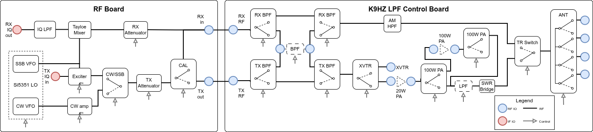
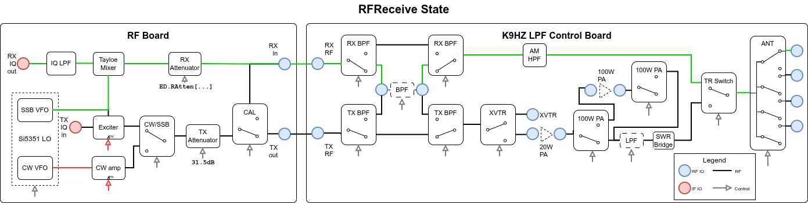
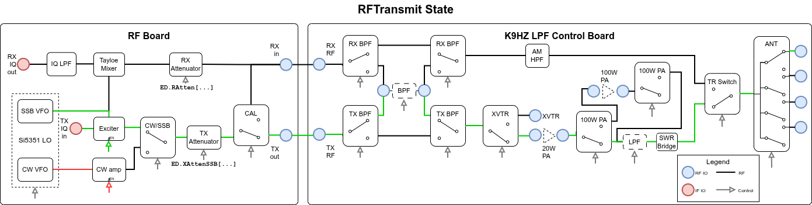
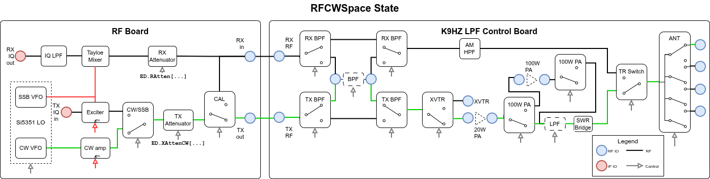

# Hardware States: RF and LPF Board Control

## Introduction

The Phoenix SDR uses a state machine architecture to manage its RF hardware. Understanding how the radio transitions between different operating modes — from receiving signals to transmitting SSB or CW — requires diving into the hardware states and the careful sequencing required to safely switch between them.

This post explores the hardware states for two boards in the T41 V12 radio: the **RF Board** and the **K9HZ LPF Control Board**. We'll examine how the firmware coordinates these boards.

## System Architecture Overview



The T41 radio separates hardware control into two main boards:

1. **RF Board**: Contains the core RF generation and switching hardware
   - Si5351 VFO (Variable Frequency Oscillator) with dual outputs for SSB and CW
   - Tayloe mixer for SDR down-conversion
   - TX/RX attenuators (digitally controlled, 0-31.5 dB in 0.5 dB steps)
   - Transmit/receive relay switching
   - Modulation path selection (SSB vs CW)
   - Calibration feedback routing

2. **K9HZ LPF Control Board**: Handles filtering and power amplification
   - Band-switched receive and transmit bandpass filters (BPF)
   - Band-switched low-pass filters (LPF) for harmonic suppression
   - Optional 100W power amplifier with bypass control
   - Transverter (XVTR) routing
   - Four-position antenna switch
   - SWR measurement bridge

## Hardware State Definitions

The firmware defines four primary RF hardware states, each representing a distinct configuration of the RF and LPF boards:

### 1. RFReceive State



The RFReceive State configures the radio for receiving signals. The "active" RF path is highlighed in green in the image above. The SSB VFO is enabled (green line), while the CW VFO is disabled (red line). The TX transmission chain is configured such any residual TX signal that might exist won't leak over to the RX side:

- **TX Attenuator**: Set to maximum (31.5 dB) for protection
- **Calibration Feedback**: Disabled
- **XVTR**: Selected (shunts TX path to ground for safety)

During transitions to this state, we prioritize receiver protection by maximizing TX attenuation and shunting the TX path before switching the antenna relay. The RX BPF improves selectivity and reduces out-of-band interference.

### 2. RFTransmit State



The RFTransmit State configures the radio for SSB voice transmission. As before, the "active" RF path is highlighted green in the image above. We assume that the 100W PA is not used and that the first antenna is in use.

### 3. RFCWMark State


The RFCWMark State configures the radio for CW transmission with carrier ON (key down). Note that a different level of attenuation is used for the TX attenuator. The CW GPIO keying output from the Teensy is connected to the ENABLE line of the CW amp for precise timing control without having to deal with the latencies of I2C communication with the CW VFO.

Not shown here, in this state we also generate a sidetone at the receiver's audio output. 

### 4. RFCWSpace State



The RFCWSpace State configures the radio for CW transmission with carrier OFF (key up, between characters). This state differs from RFCWMark by only one signal: the CW keying line. This optimization allows very fast transitions between mark and space (key down/up) without reconfiguring the entire TX chain. The antenna relay remains in TX mode to avoid excessive relay cycling during CW operation. If further attenuation of the CW VFO is needed, we can also switch the CAL signal.

## State Machine Implementation

The hardware state management is implemented in `HardwareSM.cpp` and follows a carefully orchestrated sequence to ensure safe transitions.

### State Transition Safety

The code implements several safety principles:

1. **Power-Down First**: When transitioning from TX to RX, all transmit power is reduced before switching the antenna relay:
```cpp
// From RFTransmit to RFReceive
CWoff();                      // Turn off CW carrier
DisableCWVFOOutput();         // Disable CW VFO
SetTXAttenuation(31.5);       // Maximum attenuation
TXBypassBPF();                // Remove TX BPF
SelectXVTR();                 // Shunt TX path
MyDelay(50);                  // Wait for settling
SelectRXMode();               // Finally switch relay
```

2. **Disable RX First**: When transitioning from RX to TX, the receive path is cleared before enabling transmit power:
```cpp
// From RFReceive to RFTransmit
RXBypassBPF();                // Remove RX BPF
DisableCalFeedback();         // Ensure no feedback
MyDelay(50);                  // Wait for settling
// ... configure TX chain ...
SelectTXMode();               // Finally switch relay
```

3. **Relay Settling Time**: The code includes 50ms delays after relay operations to ensure mechanical switching completes before RF power is applied. This protects both the relay contacts and downstream circuitry.

4. **Optimization for CW**: Transitions between RFCWMark and RFCWSpace only toggle the CW keying line, avoiding unnecessary reconfiguration:
```cpp
case RFCWMark:{
    if (oldrfHardwareState != RFCWSpace){
        // Full configuration only if not from RFCWSpace
        // ... configure entire TX chain ...
    }
    CWon();  // Just turn on carrier if from RFCWSpace
    break;
}
```

### I2C Write Optimization

Both the RF Board and LPF Board use MCP23017 I2C GPIO expanders to control various hardware functions. I2C transactions are relatively slow and can cause audible artifacts if performed during audio processing. The firmware implements a **write-on-change** optimization to minimize I2C traffic.

**RFBoard.cpp** (Attenuator Control):
```cpp
static uint8_t mcpA_old = 0x00;  // Cached previous value

static bool WriteGPIOARegister(void){
    if (RF_GPA_RXATT_STATE == mcpA_old) return false;  // No change needed
    mcpAtten.writeGPIOA(RF_GPA_RXATT_STATE);           // Write only if changed
    mcpA_old = RF_GPA_RXATT_STATE;                     // Update cache
    return true;
}
```

**LPFBoard.cpp** (Filter and Antenna Control):
```cpp
static uint8_t mcpA_old = 0x00;
static uint8_t mcpB_old = 0x00;

void UpdateMCPRegisters(void){
    if (mcpA_old != LPF_GPA_STATE){
        mcpLPF.writeGPIOA(LPF_GPA_STATE);
        mcpA_old = LPF_GPA_STATE;
    }
    if (mcpB_old != LPF_GPB_STATE){
        mcpLPF.writeGPIOB(LPF_GPB_STATE);
        mcpB_old = LPF_GPB_STATE;
    }
}
```

This pattern compares the desired register state with the cached previous state. If nothing has changed, the I2C write is skipped entirely. This is particularly effective when:

- Frequency changes without mode changes (same attenuation, same filters)
- Repeated calls to set the same value (defensive programming)
- Fast updates during CW keying (mark/space transitions don't change most settings)

## Mapping High-Level States to Hardware States

The `UpdateRFHardwareState()` function in `HardwareSM.cpp` serves as the bridge between the high-level operating mode state machine (`ModeSm`) and the low-level hardware states. Multiple operating modes can map to the same hardware configuration:

```cpp
switch (modeSM.state_id){
    case (ModeSm_StateId_CW_RECEIVE):
    case (ModeSm_StateId_SSB_RECEIVE):{
        rfHardwareState = RFReceive;
        break;
    }
    case (ModeSm_StateId_SSB_TRANSMIT):{
        rfHardwareState = RFTransmit;
        break;
    }
    case (ModeSm_StateId_CW_TRANSMIT_DIT_MARK):
    case (ModeSm_StateId_CW_TRANSMIT_DAH_MARK):
    case (ModeSm_StateId_CW_TRANSMIT_MARK):{
        rfHardwareState = RFCWMark;
        break;
    }
    // ... etc
}
```

This mapping allows the high-level state machine to focus on user interaction and timing (e.g., CW keyer logic with separate states for dit vs dah) while the hardware layer concerns itself only with the actual RF configuration required.

## Real-Time Considerations

The hardware state machine must execute within the main loop timing budget of 10ms to avoid audio buffer overflows. Several design choices support this requirement:

1. **Event-Driven Updates**: Hardware state changes only occur when the operating mode changes, not on every loop iteration.
2. **Optimized I2C**: The write-on-change pattern eliminates unnecessary I2C transactions.
3. **State Caching**: Previous state tracking allows the code to detect when no action is needed.
4. **Minimal Delays**: Hardware settling delays (50ms) are only inserted when actually changing states, not during steady-state operation.


## Code References

- Hardware state implementation: `code/src/PhoenixSketch/HardwareSM.cpp`
- RF board control: `code/src/PhoenixSketch/RFBoard.cpp:1-774`
- LPF board control: `code/src/PhoenixSketch/LPFBoard.cpp:1-646`
- Mode state machine: `code/src/PhoenixSketch/ModeSm.h:1-100`
