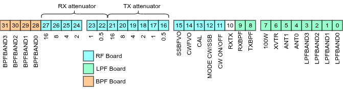

# Hardware Register: A Centralized View of Radio State

## Introduction

The Phoenix SDR firmware manages a complex array of hardware components: VFOs, attenuators, filters, relays, and amplifiers. Coordinating all these elements requires careful state tracking. To do this, we use a hardware register -- a single 32-bit variable that serves as the central source of truth for the radio's hardware configuration.

This post explores the hardware register structure, the macros used to manipulate it, and the diagnostic tools built around it. We'll see how this simplifies debugging and enables comprehensive logging.

Using a hardware register provides several key advantages:

1. Single Source of Truth
    - All hardware state exists in one place. There's no need to track separate variables for VFO status, relay positions, or attenuator settings. Query `hardwareRegister` and you have the complete picture.
2. Automatic Change Logging
    - Every modification is timestamped and recorded without explicit developer action. This is enforced at compile-time by embedding `buffer_add()` in the register manipulation macros.
3. Simplified Debugging
    - Instead of scattering `Serial.print()` statements throughout the code, you can call the `buffer_pretty_print*()` functions to see current state.
    - Examine buffer contents in unit tests to verify state transitions.
4. Test Visibility
    - Unit tests can examine the hardware register to verify that high-level operations produced the correct low-level hardware changes.
5. Performance Monitoring
    - The microsecond timestamps reveal the timing of hardware state changes, such as how long does it take to transition from RX to TX.

## The Hardware Register Map

The hardware register is a 32-bit unsigned integer (`uint32_t hardwareRegister`) defined in `SDT.h:45`. Each bit or group of bits represents a specific hardware function. The bit positions are defined as named constants in `SDT.h:48-71`.



The register is organized into three main sections corresponding to the three hardware control boards:

### LPF Board (Bits 0-10)
- **Bits 0-3**: LPF band selection (4-bit BCD code)
- **Bits 4-5**: Antenna selection (2 bits, 4 antennas)
- **Bit 6**: Transverter (XVTR) enable
- **Bit 7**: 100W power amplifier enable
- **Bit 9**: RX bandpass filter control
- **Bit 8**: TX bandpass filter control
- **Bit 10**: RX/TX relay state

### RF Board (Bits 10-27)
- **Bit 10**: RX/TX relay state
- **Bit 11**: CW keying (mark/space)
- **Bit 12**: Transmit mode (SSB vs CW)
- **Bit 13**: Calibration feedback (CAL)
- **Bit 14**: CW VFO enable/disable
- **Bit 15**: SSB VFO enable/disable
- **Bits 16-21**: TX attenuator value (6 bits, 0-63 representing 0.0-31.5 dB in 0.5 dB steps)
- **Bits 22-27**: RX attenuator value (6 bits, 0-63 representing 0.0-31.5 dB in 0.5 dB steps)

### BPF Board (Bits 28-31)
- **Bits 28-31**: BPF band selection (4-bit BCD code)

## Hardware Register Manipulation Macros

The firmware uses four fundamental macros for single-bit manipulation (`SDT.h:87-90`):

### GET_BIT: Reading a Single Bit

```cpp
#define GET_BIT(byte, bit) (((byte) >> (bit)) & 1)
```

This macro extracts a single bit value, returning 0 or 1:

```cpp
// Check if CW keying is active
if (GET_BIT(hardwareRegister, CWBIT)) {
    // CW carrier is on
}
```

**How it works:**

1. Right-shift the register by `bit` positions to move the target bit to position 0
2. Mask with `& 1` to isolate only the lowest bit
3. Returns 1 if the bit was set, 0 if it was clear

Real-world usage from `RFBoard.cpp:586`:

```cpp
bool IsCWon(void){
    return GET_BIT(hardwareRegister,CWBIT);
}
```

### SET_BIT: Setting a Single Bit to 1

```cpp
#define SET_BIT(byte, bit) ((byte) |= (1 << (bit)));buffer_add()
```

This macro sets a specific bit to 1 without affecting other bits:

```cpp
// Enable the SSB VFO
SET_BIT(hardwareRegister, SSBVFOBIT);
```

**How it works:**

1. Create a mask with only the target bit set: `(1 << bit)`
2. OR it with the current register value: `|=`
3. Automatically calls `buffer_add()` to log the change

Real-world usage from `RFBoard.cpp:424`:

```cpp
void EnableSSBVFOOutput(void){
    if (Si5351_found) {
        si5351.output_enable(SI5351_CLK0, 1);
        if (si5351_error == SI5351_INVALID_PARAMETER){
            Debug("EnableSSBVFOOutput: Invalid parameter!");
            return;
        }
        if (si5351_error == SI5351_I2C_ERROR){
            Debug("EnableSSBVFOOutput: I2C error!");
            return;
        }
        SET_BIT(hardwareRegister,SSBVFOBIT);
    }
}
```

### CLEAR_BIT: Clearing a Single Bit to 0

```cpp
#define CLEAR_BIT(byte, bit) ((byte) &= ~(1 << (bit)));buffer_add()
```

This macro clears a specific bit to 0 without affecting other bits:

```cpp
// Disable the CW VFO
CLEAR_BIT(hardwareRegister, CWVFOBIT);
```

**How it works:**

1. Create a mask with only the target bit set: `(1 << bit)`
2. Invert it so all bits except the target are 1: `~(1 << bit)`
3. AND it with the current register value: `&=`
4. Automatically calls `buffer_add()` to log the change

Real-world usage from `RFBoard.cpp:467`:

```cpp
void DisableSSBVFOOutput(void){
    if (Si5351_found) si5351.output_enable(SI5351_CLK0, 0);
    CLEAR_BIT(hardwareRegister,SSBVFOBIT);
}
```

### TOGGLE_BIT: Flipping a Bit's State

```cpp
#define TOGGLE_BIT(byte, bit) ((byte) ^= (1 << (bit)));buffer_add()
```

This macro inverts a bit (0→1 or 1→0):

```cpp
// Toggle calibration feedback on/off
TOGGLE_BIT(hardwareRegister, CALBIT);
```

**How it works:**

1. Create a mask with only the target bit set: `(1 << bit)`
2. XOR it with the current register value: `^=`
3. XOR flips the bit: 0^1=1, 1^1=0
4. Automatically calls `buffer_add()` to log the change

### Automatic Logging with buffer_add()

Notice that `SET_BIT`, `CLEAR_BIT`, and `TOGGLE_BIT` all end with `;buffer_add()`. This design pattern ensures that every hardware register modification is automatically logged. There's no way to change the register without creating a timestamped record.

This automatic logging is invaluable for:

- **Debugging state machine transitions**: See exactly when each bit changed
- **Performance analysis**: Identify unnecessary register updates
- **Testing**: Verify that hardware states match expectations
- **Post-mortem debugging**: Examine the sequence of events leading to a problem

## Multi-Bit Field Macros

Some hardware components require more than a single bit. The TX and RX attenuators each use 6 bits to represent 64 attenuation levels (0.0 to 31.5 dB in 0.5 dB steps). The firmware uses specialized macros for these multi-bit fields.

### Extracting Multi-Bit Fields

Defined in `RFBoard.cpp:34-35`:

```cpp
#define RF_GPA_RXATT_STATE (uint8_t)((hardwareRegister >> RXATTLSB) & 0x0000003F)
#define RF_GPB_TXATT_STATE (uint8_t)((hardwareRegister >> TXATTLSB) & 0x0000003F)
```

These macros extract 6-bit values from the register:

**How they work:**

1. Right-shift the register to align the field's LSB with bit 0
2. Mask with `0x3F` (binary `111111`) to extract only the 6-bit field
3. Cast to `uint8_t` for the return value

**Example:** If `hardwareRegister = 0x350000` (binary: `...0011 0101 0000 0000 0000 0000`):

- `TXATTLSB = 16`, so the TX attenuator bits are at positions 16-21
- `(hardwareRegister >> 16) = 0x...35 = 0b...110101`
- `0x35 & 0x3F = 0x35` (binary `110101` = decimal 53)
- This represents 53 × 0.5 dB = 26.5 dB of TX attenuation

### Setting Multi-Bit Fields

Defined in `RFBoard.cpp:36-37`:

```cpp
#define SET_RF_GPA_RXATT(val) (hardwareRegister = (hardwareRegister & 0xF03FFFFF) | (((uint32_t)val & 0x0000003F) << RXATTLSB));buffer_add()
#define SET_RF_GPB_TXATT(val) (hardwareRegister = (hardwareRegister & 0xFFC0FFFF) | (((uint32_t)val & 0x0000003F) << TXATTLSB));buffer_add()
```

These macros update a multi-bit field without disturbing other bits:

**How they work (using SET_RF_GPB_TXATT as an example):**

1. **Clear the target field**: `hardwareRegister & 0xFFC0FFFF`
   - `0xFFC0FFFF = 1111 1111 1100 0000 1111 1111 1111 1111`
   - Bits 16-21 are 0, all others are 1
   - ANDing clears the TX attenuator bits while preserving everything else

2. **Prepare the new value**: `((uint32_t)val & 0x0000003F) << TXATTLSB`
   - Mask `val` with `0x3F` to ensure it's only 6 bits
   - Left-shift by `TXATTLSB` (16) to position it correctly

3. **Merge**: OR the cleared register with the new value
   - Sets the TX attenuator bits to `val`
   - All other bits remain unchanged

4. **Log**: Automatically calls `buffer_add()`

Real-world usage from `RFBoard.cpp:141`:

```cpp
void SetTXAttenuation(float32_t val){
    uint8_t valx2 = (uint8_t)(val*2.0);
    if (valx2 > MAX_ATTENUATION_VAL_DBx2){
        valx2 = MAX_ATTENUATION_VAL_DBx2;
    }
    if (valx2 < MIN_ATTENUATION_VAL_DBx2){
        valx2 = MIN_ATTENUATION_VAL_DBx2;
    }
    SET_RF_GPB_TXATT(valx2);
    WriteGPIOBRegister();
}
```

### Band Selection Macro

Another multi-bit macro extracts the LPF band selection (`SDT.h:91`):

```cpp
#define GET_LPF_BAND (uint8_t)(hardwareRegister & 0x0000000F)
```

This simply masks the lowest 4 bits, which encode the band selection using BCD:

```cpp
#define BAND_160M_BCD 0b0001
#define BAND_80M_BCD  0b0010
#define BAND_60M_BCD  0b0000
#define BAND_40M_BCD  0b0011
// ... etc
```

## The Hardware Register Rolling Buffer

Every time the hardware register changes, a timestamped snapshot is automatically stored in a rolling buffer. This provides a complete audit trail of hardware state transitions.

### Buffer Structure

Defined in `SDT.h:591-603`:

```cpp
/** Structure of a hardware register buffer entry */
typedef struct {
    uint32_t timestamp;         // Microsecond timestamp
    uint32_t register_value;    // Full 32-bit register snapshot
} BufferEntry;

/** Rolling buffer to store hardware register changes */
typedef struct {
    BufferEntry entries[REGISTER_BUFFER_SIZE];  // 100 entries
    size_t head;        // Index where next entry will be written
    size_t count;       // Number of valid entries (up to BUFFER_SIZE)
} RollingBuffer;
extern RollingBuffer buffer;
```

The buffer stores up to 100 timestamped register values (configurable via `REGISTER_BUFFER_SIZE` in `SDT.h:94`). When full, it wraps around and overwrites the oldest entry.

### buffer_add(): Recording Changes

Implemented in `Globals.cpp:183-190`:

```cpp
void buffer_add(void) {
    buffer.entries[buffer.head].timestamp = micros();
    buffer.entries[buffer.head].register_value = hardwareRegister;
    buffer.head = (buffer.head + 1) % REGISTER_BUFFER_SIZE;  // Wrap around
    if (buffer.count < REGISTER_BUFFER_SIZE) {
        buffer.count++;
    }
}
```

This function:

1. Records the current microsecond timestamp (`micros()`)
2. Snapshots the current `hardwareRegister` value
3. Advances the circular buffer head pointer
4. Tracks the number of valid entries (up to buffer size)

Because `buffer_add()` is embedded in the `SET_BIT`, `CLEAR_BIT`, `TOGGLE_BIT`, and multi-bit field macros, every hardware register change is automatically logged without any explicit action.

### buffer_flush(): Clearing the Buffer

Implemented in `Globals.cpp:196-203`:

```cpp
void buffer_flush(void) {
    for (size_t i = 0; i < REGISTER_BUFFER_SIZE; i++){
        buffer.entries[i].timestamp = 0;
        buffer.entries[i].register_value = 0;
    }
    buffer.count = 0;
    buffer.head = 0;
}
```

Clears all entries and resets the buffer pointers. Useful for starting a fresh recording session during testing or debugging.

## Examining the Hardware Register

The firmware provides several diagnostic functions to display the buffer contents in human-readable format.

### buffer_pretty_print(): Full Buffer Dump

Implemented in `Globals.cpp:210-274`:

```cpp
void buffer_pretty_print(void) {
    Debug("=== Hardware Register Buffer Contents ===");
    Debug("Buffer size: " + String((unsigned int)buffer.count) + "/" + String((unsigned int)REGISTER_BUFFER_SIZE));
    Debug("Head index: " + String((unsigned int)buffer.head));

    if (buffer.count == 0) {
        Debug("Buffer is empty");
        return;
    }

    Debug("Entries (oldest to newest):");
    Debug("|               |              X 1     R   M   C S               |");
    Debug("|               |           A  V 0 T R X   O C A F F             |");
    Debug("|               |           n  T 0 X X T C D L O O               |");
    Debug("| Timestamp(μs) | LPF  BPF  t  R W B B X W E L O O TXATT  RXATT  |");
    Debug("|---------------|------------------------------------------------|");

    // Print each entry...
}
```

**Example output:**

```
=== Hardware Register Buffer Contents ===
Buffer size: 42/100
Head index: 42
Entries (oldest to newest):
|               |              X 1     R   M   C S               |
|               |           A  V 0 T R X   O C V V               |
|               |           n  T 0 X X T C D A F F               |
| Timestamp(μs) | LPF  BPF  t  R W B B X W E L O O TXATT  RXATT  |
|---------------|------------------------------------------------|
| 3             | 0011 0011 00 0 0 0 0 0 0 1 0 0 1 000000 000000 |
| 4             | 0011 0011 00 0 0 0 0 0 0 1 0 0 0 000000 000000 |
...
```

Each row shows:

- **Timestamp**: When the change occurred (in microseconds)
- **LPF**: 4-bit band selection for low-pass filters
- **BPF**: 4-bit band selection for bandpass filters
- **Ant**: 2-bit antenna selection
- **XVTR**: Transverter enable
- **100W**: 100W PA enable
- **TX/RX BPF**: TX and RX bandpass filter control
- **TX**: TX/RX relay state
- **CW**: CW keying state
- **MODE**: SSB/CW mode
- **CAL**: Calibration feedback
- **SSB/CW VFO**: VFO enable states
- **TXATT/RXATT**: 6-bit attenuator values

### buffer_pretty_print_last_entry(): Quick Status Check

Implemented in `Globals.cpp:341-351`:

```cpp
void buffer_pretty_print_last_entry(void) {
    Debug("|               |              X 1     R   M   C S               |");
    Debug("|               |           A  V 0 T R X   O C A F F               |");
    Debug("|               |           n  T 0 X X T C D L O O               |");
    Debug("| Timestamp(μs) | LPF  BPF  t  R W B B X W E L O O TXATT  RXATT  |");
    Debug("|---------------|------------------------------------------------|");
    BufferEntry entry;
    if (buffer.head > 0) entry = buffer.entries[buffer.head-1];
    else entry = buffer.entries[REGISTER_BUFFER_SIZE-1];
    pretty_print_line(entry);
}
```

Shows only the most recent buffer entry. Useful for quickly checking the current hardware state without dumping the entire buffer.

### regtostring(): Bit Field Formatting

Implemented in `Globals.cpp:281-289`:

```cpp
String regtostring(uint32_t register_value, uint8_t MSB, uint8_t LSB){
    String binary = "";
    for (int bit = MSB; bit >= LSB; bit--) {
        binary += ((register_value >> bit) & 1) ? "1" : "0";
    }
    return binary;
}
```

Extracts a multi-bit field from the register and formats it as a binary string. Used by `pretty_print_line()` to display each field:

```cpp
line += regtostring(entry.register_value, LPFBAND3BIT, LPFBAND0BIT);  // "0101"
line += regtostring(entry.register_value, SSBVFOBIT, SSBVFOBIT);      // "1"
line += regtostring(entry.register_value, TXATTMSB, TXATTLSB);        // "011111"
```

This function handles both single bits (MSB == LSB) and multi-bit fields (MSB > LSB).

### pretty_print_line(): Formatting a Buffer Entry

Implemented in `Globals.cpp:297-334`:

```cpp
void pretty_print_line(BufferEntry entry){
    String line = "| ";
    line += String((unsigned int)entry.timestamp, DEC);
    // Pad timestamp
    while (line.length() < 15) line += " ";
    line += " | ";
    line += regtostring(entry.register_value, LPFBAND3BIT, LPFBAND0BIT);
    line += " ";
    line += regtostring(entry.register_value, BPFBAND3BIT, BPFBAND0BIT);
    line += " ";
    line += regtostring(entry.register_value, ANT1BIT, ANT0BIT);
    // ... continues for all fields ...
    line += " |";
    Debug(line);
}
```

Builds a formatted table row showing all hardware register fields in a structured, readable format.

## Code References

- Hardware register declaration and bit definitions: `code/src/PhoenixSketch/SDT.h:44-91`
- Single-bit manipulation macros: `code/src/PhoenixSketch/SDT.h:87-90`
- Multi-bit field macros: `code/src/PhoenixSketch/RFBoard.cpp:34-37`
- Buffer structure: `code/src/PhoenixSketch/SDT.h:591-603`
- Buffer manipulation functions: `code/src/PhoenixSketch/Globals.cpp:183-374`
- RF board usage examples: `code/src/PhoenixSketch/RFBoard.cpp:424-677`
- LPF board usage examples: `code/src/PhoenixSketch/LPFBoard.cpp:1-646`
