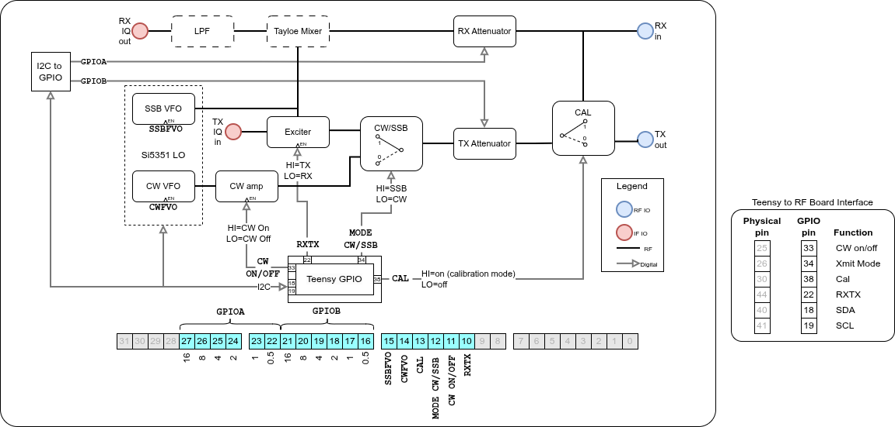
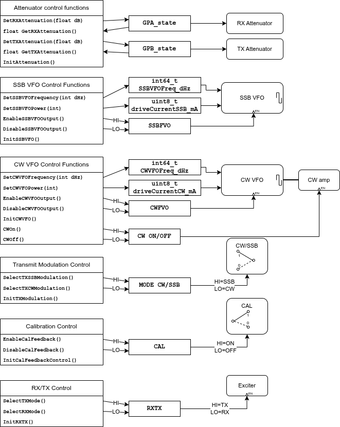

# RF Board API: Hardware Control Through Software Abstraction

## Introduction

The RF Board is the heart of the T41 V12 SDR's RF signal path. It houses the Si5351 clock generator (which serves as dual VFOs), the Tayloe mixer for quadrature down-conversion, digitally controlled attenuators, and various RF switching relays. Controlling this hardware requires coordination of I2C communication, GPIO signals, and hardware state tracking.

This post explores the RF Board API -- software interface that abstracts hardware complexity while maintaining real-time performance. We'll examine how the API functions modify the hardware register, and how the implementation uses state knowledge to minimize slow I2C transactions.

## RF Board Hardware Architecture



The RF Board diagram above shows the complete signal path and control structure:

### Signal Path Components

**Receive Path (Top)**

- RX in from the K9HZ LPF control board
- RX Attenuator (0-31.5 dB, digitally controlled via I2C)
- Tayloe mixer performs quadrature down-conversion using the SSB VFO's I/Q outputs
- LPF (Low-Pass Filter) amplifies and limits the bandwidth of the IF signal
- Output to the Teensy's ADC inputs (RX in)

**Transmit Path (Bottom)**

- Teensy DAC outputs (TX IQ in) feed the Exciter
- Exciter output goes through modulation switching (SSB vs CW)
- In CW mode, the Si5351 VFO generates a tone at the desired CW frequeuncy
- TX Attenuator (0-31.5 dB, digitally controlled via I2C)
- Calibration feedback switch (CAL) can loop TX back to RX for testing
- Output to K9HZ LPF control board (TX out)

### Control Components

**Si5351 Dual VFO**

- **SSB VFO** (CLK0 & CLK1): Quadrature outputs for SSB RX/TX
- **CW VFO** (CLK2): Single output for CW transmission
- Controlled via I2C (pins 18/19: SDA/SCL)

**MCP23017 I2C GPIO Expander**

- **GPIOA**: Controls RX attenuator (6 bits)
- **GPIOB**: Controls TX attenuator (6 bits)
- I2C address allows reading/writing both banks

**Teensy GPIO Pins**

- **Pin 33**: CW ON/OFF - Direct keying control for fast CW switching
- **Pin 34**: XMIT Mode - SSB vs CW modulation selection
- **Pin 38**: CAL - Calibration feedback enable
- **Pin 22**: RXTX - Main TX/RX relay control

This architecture separates fast-switching signals (CW keying, RXTX relay) onto direct GPIO pins, while slower-changing settings (attenuation) use I2C GPIO expansion.

## API Functional Organization



The RF Board API is organized into six functional groups, each managing a specific aspect of the hardware. Each group includes initialization, configuration, and query functions.

### 1. Attenuator Control Functions

The attenuators provide 0-31.5 dB of digitally controlled attenuation in 0.5 dB steps (6 bits = 64 levels):

```cpp
errno_t SetRXAttenuation(float32_t rxAttenuation_dB);
errno_t SetTXAttenuation(float32_t txAttenuation_dB);
float32_t GetRXAttenuation(void);
float32_t GetTXAttenuation(void);
errno_t InitAttenuation(void);
```

These functions modify the hardware register fields `RXATTLSB`-`RXATTMSB` (bits 22-27) and `TXATTLSB`-`TXATTMSB` (bits 16-21).

### 2. SSB VFO Control Functions

The SSB VFO generates quadrature (I/Q) outputs for SSB operation using Si5351 CLK0 and CLK1:

```cpp
void SetSSBVFOFrequency(int64_t frequency_dHz);
int64_t GetSSBVFOFrequency(void);
void SetSSBVFOPower(int32_t power);
void EnableSSBVFOOutput(void);
void DisableSSBVFOOutput(void);
errno_t InitSSBVFO(void);
```

These functions control the `SSBVFOBIT` (bit 15) in the hardware register and communicate with the Si5351 via I2C to set frequency and power, and enable/disable the CLK0/CLK1 clock outputs.

### 3. CW VFO Control Functions

The CW VFO uses Si5351 CLK2 for CW transmission, with direct GPIO control for fast keying:

```cpp
void SetCWVFOFrequency(int64_t frequency_dHz);
int64_t GetCWVFOFrequency(void);
void SetCWVFOPower(int32_t power);
void EnableCWVFOOutput(void);
void DisableCWVFOOutput(void);
errno_t InitCWVFO(void);
void CWon(void);
void CWoff(void);
```

These functions control the `CWVFOBIT` (bit 14) and `CWBIT` (bit 11) in the hardware register. The `CWon()`/`CWoff()` functions directly toggle Teensy pin 33 for fast keying response.

### 4. Transmit Modulation Control

Switches between SSB and CW modulation paths:

```cpp
void SelectTXSSBModulation(void);
void SelectTXCWModulation(void);
errno_t InitTXModulation(void);
```

These functions control the `MODEBIT` (bit 12), which drives Teensy pin 34 to select the modulation path.

### 5. Calibration Control

Enables/disables the calibration feedback loop for testing:

```cpp
void EnableCalFeedback(void);
void DisableCalFeedback(void);
errno_t InitCalFeedbackControl(void);
```

These functions control the `CALBIT` (bit 13), which drives Teensy pin 38 to route TX output back to RX input.

### 6. RX/TX Control

Switches the main antenna relay between receive and transmit:

```cpp
void SelectTXMode(void);
void SelectRXMode(void);
errno_t InitRXTX(void);
```

These functions control the `RXTXBIT` (bit 10), which drives Teensy pin 22 to control the T/R relay.

## How API Functions Modify the Hardware Register

All RF Board API functions follow a consistent pattern: they modify specific bits or bit fields in the 32-bit `hardwareRegister`, then perform I2C or GPIO writes to update the physical hardware.

### Single-Bit Hardware Register Updates

For simple on/off controls, functions use the `SET_BIT`, `CLEAR_BIT`, and `GET_BIT` macros:

**Example: Enabling SSB VFO Output** (`RFBoard.cpp:455-459`)

```cpp
void EnableSSBVFOOutput(void){
    si5351.output_enable(SI5351_CLK0, 1);
    si5351.output_enable(SI5351_CLK1, 1);
    SET_BIT(hardwareRegister,SSBVFOBIT);
}
```

This function:
1. Enables the Si5351 CLK0 and CLK1 outputs via I2C
2. Sets bit 15 (`SSBVFOBIT`) in the hardware register
3. Automatically logs the change via `buffer_add()` (embedded in `SET_BIT`)

**Example: CW Keying Control** (`RFBoard.cpp:557-568`)

```cpp
void CWon(void){
    if (!GET_BIT(hardwareRegister,CWBIT)) digitalWrite(CW_ON_OFF, 1);
    SET_BIT(hardwareRegister,CWBIT);
}

void CWoff(void){
    if (GET_BIT(hardwareRegister,CWBIT)) digitalWrite(CW_ON_OFF, 0);
    CLEAR_BIT(hardwareRegister,CWBIT);
}
```

These functions demonstrate the state-aware optimization pattern:

1. Check the current state using `GET_BIT(hardwareRegister, CWBIT)`
2. Only perform the GPIO write if the state is actually changing
3. Update the hardware register bit to reflect the new state
4. The change is automatically logged

This pattern avoids redundant GPIO operations and ensures the hardware register always reflects actual hardware state.

### Multi-Bit Field Updates

The attenuators require 6-bit fields (0-63) to represent 0-31.5 dB in 0.5 dB steps. Special macros handle these multi-bit updates.

**Field Extraction Macros** (`RFBoard.cpp:34-35`):

```cpp
#define RF_GPA_RXATT_STATE (uint8_t)((hardwareRegister >> RXATTLSB) & 0x0000003F)
#define RF_GPB_TXATT_STATE (uint8_t)((hardwareRegister >> TXATTLSB) & 0x0000003F)
```

These macros extract the 6-bit attenuator values from the hardware register.

**Field Update Macros** (`RFBoard.cpp:36-37`):

```cpp
#define SET_RF_GPA_RXATT(val) (hardwareRegister = (hardwareRegister & 0xF03FFFFF) | (((uint32_t)val & 0x0000003F) << RXATTLSB));buffer_add()
#define SET_RF_GPB_TXATT(val) (hardwareRegister = (hardwareRegister & 0xFFC0FFFF) | (((uint32_t)val & 0x0000003F) << TXATTLSB));buffer_add()
```

These macros:

1. Clear the target 6-bit field using an AND mask
2. Insert the new value using an OR operation
3. Automatically call `buffer_add()` to log the change

**Example: Setting RX Attenuation** (`RFBoard.cpp:240-249`)

```cpp
errno_t SetRXAttenuation(float32_t rxAttenuation_dB){
    // Only do this if the attenuation value has changed from the current value. This avoids
    // unnecessary I2C writes that slow things down and generates noise
    uint8_t newRegisterValue = (uint8_t)check_range((int32_t)round(2*rxAttenuation_dB));
    if (newRegisterValue == RF_GPA_RXATT_STATE){
        return ESUCCESS;
    } else {
        return SetAttenuator((int32_t)round(2*rxAttenuation_dB), RX);
    }
}
```

This function demonstrates the complete flow:

1. Convert dB value to 2×dB integer (e.g., 15.5 dB → 31)
2. Check if the new value differs from current register value
3. **Early exit if unchanged** - avoid I2C transaction entirely
4. If changed, call `SetAttenuator()` to update register and hardware

The `SetAttenuator()` function (`RFBoard.cpp:124-134`) then:

```cpp
static errno_t SetAttenuator(int32_t Attenuation_dBx2, uint8_t GPIO_register){
    if (GPIO_register == TX) {
        SET_RF_GPB_TXATT( (uint8_t)check_range(Attenuation_dBx2) );
        WriteGPIOBRegister();
    }
    if (GPIO_register == RX) {
        SET_RF_GPA_RXATT( (uint8_t)check_range(Attenuation_dBx2) );
        WriteGPIOARegister();
    }
    return ESUCCESS;
}
```

1. Updates the hardware register using `SET_RF_GPA_RXATT()` or `SET_RF_GPB_TXATT()`
2. Calls `WriteGPIOARegister()` or `WriteGPIOBRegister()` to write to I2C

## Optimizing I2C Performance with State Caching

I2C transactions are relatively slow (typically 400 kHz bus speed) and can introduce audible artifacts during real-time audio processing. The RF Board API uses **two-level state caching** to minimize I2C traffic:

### Level 1: Hardware Register State Check

Before performing any operation, API functions check if the hardware register already contains the desired value. If so, they return immediately without any I2C transaction.

**Example from `SetRXAttenuation()`** (`RFBoard.cpp:243-245`):

```cpp
uint8_t newRegisterValue = (uint8_t)check_range((int32_t)round(2*rxAttenuation_dB));
if (newRegisterValue == RF_GPA_RXATT_STATE){
    return ESUCCESS;  // No change needed, skip I2C write entirely
}
```

### Level 2: I2C Register State Caching

Even when the hardware register changes, the actual I2C write is skipped if the MCP23017's GPIO registers already contain the correct value. This is implemented using cached register values.

**Private State Variables** (`RFBoard.cpp:30-31`):

```cpp
static uint8_t mcpA_old = 0x00;
static uint8_t mcpB_old = 0x00;
```

**Write Function with Caching** (`RFBoard.cpp:83-88`):

```cpp
static bool WriteGPIOARegister(void){
    if (RF_GPA_RXATT_STATE == mcpA_old) return false;
    mcpAtten.writeGPIOA(RF_GPA_RXATT_STATE);
    mcpA_old = RF_GPA_RXATT_STATE;
    return true;
}
```

This function:
1. Compares desired register value with cached previous value
2. Returns `false` immediately if unchanged (no I2C transaction)
3. Only performs I2C write if the value has changed
4. Updates the cache after successful write

**Why Two Levels?**

This dual-layer approach handles different scenarios:

1. **Application-level redundancy**: High-level code might call `SetRXAttenuation(15.5)` multiple times. Level 1 catches this.

2. **Multi-bit field collisions**: Changes to TX attenuation modify `hardwareRegister` but don't affect GPIOA. Level 2 prevents unnecessary RX attenuator writes.

3. **State machine safety**: Defensive programming in state machines may set values "just to be sure." The caching makes this pattern essentially free.

### CW Keying Optimization

The CW keying functions demonstrate another state-aware optimization:

**CW Keying with State Check** (`RFBoard.cpp:557-568`):

```cpp
void CWon(void){
    if (!GET_BIT(hardwareRegister,CWBIT)) digitalWrite(CW_ON_OFF, 1);
    SET_BIT(hardwareRegister,CWBIT);
}
```

The `digitalWrite()` only occurs if the bit isn't already set. This optimization is crucial for CW operation because:

1. **Multiple calls per dit/dah**: The state machine may call `CWon()` multiple times during a single key-down period
2. **Microsecond timing**: Even a single unnecessary GPIO write adds latency
3. **Electrical noise**: Toggling a GPIO line generates EMI that can couple into the audio path

### VFO Frequency Change Optimization

The VFO frequency setters also implement state awareness:

**SSB VFO Frequency** (`RFBoard.cpp:401-403`):

```cpp
void SetSSBVFOFrequency(int64_t frequency_dHz){
    // No need to change if it's already at this setting
    if (frequency_dHz == SSBVFOFreq_dHz) return;
    // ... continue with Si5351 configuration
}
```

**CW VFO Frequency** (`RFBoard.cpp:491-493`):

```cpp
void SetCWVFOFrequency(int64_t frequency_dHz){
    // No need to change if it's already at this setting
    if (frequency_dHz == CWVFOFreq_dHz) return;
    // ... continue with Si5351 configuration
}
```

Si5351 frequency changes are expensive (multiple I2C writes to configure PLL parameters). Skipping unchanged frequencies provides major performance benefits.

## Initialization and Board Discovery

The RF Board API uses lazy initialization - I2C connections are established only when first needed, not at startup.

**Board-Level Initialization** (`RFBoard.cpp:52-75`):

```cpp
static bool InitI2C(void){
    Debug("Initializing RF board");
    if (!mcpAtten.begin_I2C(RF_MCP23017_ADDR)) {
        bit_results.RF_I2C_present = false;
    } else {
        bit_results.RF_I2C_present = true;
    }

    if(bit_results.RF_I2C_present) {
        for (int i=0;i<16;i++){
            mcpAtten.pinMode(i, OUTPUT);
        }
        // Set all pins to zero. This means no attenuation
        SET_RF_GPA_RXATT(0x00);
        SET_RF_GPB_TXATT(0x00);
        mcpAtten.writeGPIOA(RF_GPA_RXATT_STATE);
        mcpAtten.writeGPIOB(RF_GPB_TXATT_STATE);
        mcpA_old = RF_GPA_RXATT_STATE;
        mcpB_old = RF_GPB_TXATT_STATE;
    }
    return true;
}
```

This function:

1. Attempts I2C connection to MCP23017
2. Records success/failure in `bit_results.RF_I2C_present`
3. Configures all GPIO pins as outputs
4. Initializes both attenuators to 0 dB
5. Initializes the cache variables

The lazy initialization pattern (`RFBoard.cpp:147-157`):

```cpp
static errno_t AttenuatorCreate(float32_t Attenuation_dB, errno_t (*SetAtten)(float32_t)){
    if (!boardInitialized){
        boardInitialized = InitI2C();
    }
    if (!boardInitialized) {
        error_state = ENOI2C;
    } else {
        error_state = SetAtten(Attenuation_dB);
    }
    return error_state;
}
```

This allows the firmware to:

- Detect missing hardware gracefully
- Continue operation even if RF board is absent (useful for testing)
- Avoid initialization order dependencies

## VFO Quadrature Generation

The SSB VFO generates quadrature (90-degree phase-shifted) outputs required for the Tayloe mixer. The implementation differs based on frequency range.

**High Frequency (>3.2 MHz): Phase-Locked Method** (`RFBoard.cpp:416-426`)

```cpp
si5351.set_freq_manual(freq, pll_freq, SI5351_CLK0);
si5351.set_freq_manual(freq, pll_freq, SI5351_CLK1);
si5351.set_phase(SI5351_CLK0, 0);
si5351.set_phase(SI5351_CLK1, multiple);  // 90-degree phase shift
si5351.pll_reset(SI5351_PLLA);            // Align outputs
```

For higher frequencies, the Si5351 can directly generate quadrature outputs using its phase register and a PLL reset to align them.

**Low Frequency (<3.2 MHz): Timed Delay Method** (`RFBoard.cpp:432-441`)

```cpp
si5351.set_freq_manual((freq - 400ULL), pll_freq, SI5351_CLK0);
si5351.set_freq_manual((freq - 400ULL), pll_freq, SI5351_CLK1);
si5351.pll_reset(SI5351_PLLA);             // Align both clocks
si5351.set_freq_manual(freq, pll_freq, SI5351_CLK0);
delayMicroseconds(58500);                   // Precise delay for 90° at 4 Hz offset
si5351.set_freq_manual(freq, pll_freq, SI5351_CLK1);
```

For lower frequencies, the phase register resolution is insufficient. This [technique](https://tj-lab.org/2020/08/27/si5351単体で3mhz以下の直交信号を出力する/):

1. Sets both clocks 4 Hz below the target frequency low and aligns them
2. Updates CLK0 to target frequency
3. Waits precisely calculated delay (1/4 cycle at 4 Hz = 62.5 ms, tuned to 58.5 ms)
4. Updates CLK1 to target frequency
5. The timing creates a 90-degree phase offset

This approach ensures proper quadrature generation across the entire HF spectrum.

## Code References

- RF Board API header: `code/src/PhoenixSketch/RFBoard.h:1-55`
- RF Board implementation: `code/src/PhoenixSketch/RFBoard.cpp:1-774`
- Attenuator control: `code/src/PhoenixSketch/RFBoard.cpp:193-270`
- SSB VFO control: `code/src/PhoenixSketch/RFBoard.cpp:296-468`
- CW VFO control: `code/src/PhoenixSketch/RFBoard.cpp:472-587`
- I2C caching implementation: `code/src/PhoenixSketch/RFBoard.cpp:83-100`
- Hardware register macros: `code/src/PhoenixSketch/RFBoard.cpp:34-37`
- VFO initialization: `code/src/PhoenixSketch/RFBoard.cpp:593-609`
