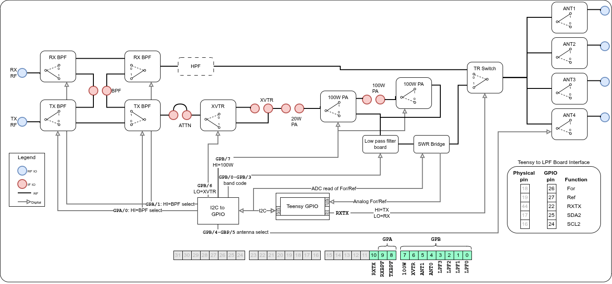
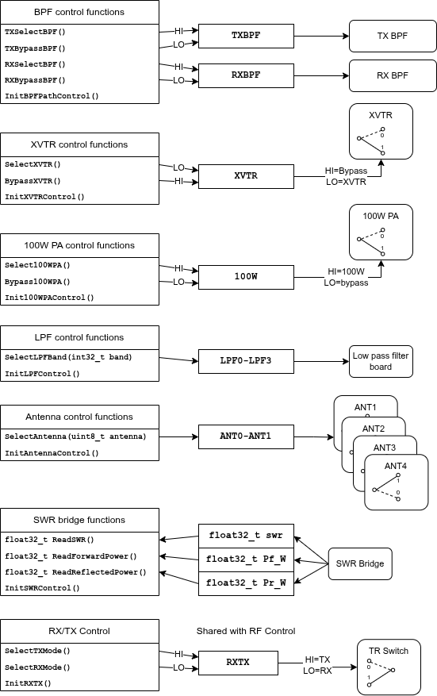

# LPF Board API: Filter Management and Power Monitoring

## Introduction

The K9HZ LPF Control Board is the final stage in the T41 V12 SDR's signal path, sitting between the RF Board and the antenna system. It provides critical functions: harmonic suppression through band-switched low-pass filters, additional selectivity through bandpass filters, antenna switching, power amplifier control, and real-time SWR (Standing Wave Ratio) measurement.

This post explores the LPF Board API - the software interface that manages these hardware functions. We'll examine the hardware architecture, the API's functional organization, how functions modify the hardware register, and the SWR measurement system that monitors transmit power and antenna matching.

## LPF Board Hardware Architecture



The LPF Board diagram shows the complete signal routing and control structure for this external hardware module.

### Signal Path Components

**Receive Path (Top)**

- RX RF input from antenna system
- Optional highpass filter to block AM radio
- Software-selectable bypass or bandpass filtering for improved selectivity
- Output to RF Board's receive input

**Transmit Path (Bottom)**

- TX RF input from RF Board
- BPF provides intermodulation distortion suppression
- Attenuator pad for power level adjustment (not used in T41 radio)
- XVTR Switch routes signal to transverter or continues through main path (not used in T41 radio)
- Optional high-power amplifier
  - 20W PA bypass option for QRP operation
  - 100W PA selection for full power
- Low Pass Filter Board for harmonic suppression (11 bands: 160m-6m)
- SWR Bridge directional coupler for forward/reflected power measurement
- Transmit/receive antenna switching
- Antenna Selection between four antenna ports (ANT1-ANT4)

### Control Components

**MCP23017 I2C GPIO Expander**

- **GPIOB[7]**: 100W PA selection (HI=100W, LO=bypass)
- **GPIOB[6]**: XVTR selection (HI=bypass, LO=XVTR)
- **GPIOB[4:5]**: Antenna selection (2 bits, 4 antennas)
- **GPIOB[0:3]**: LPF band selection (4-bit BCD code)
- **GPIOA[1]**: RX BPF select (HI=BPF, LO=bypass)
- **GPIOA[0]**: TX BPF select (HI=BPF, LO=bypass)

The MCP23017 is accessed via the Teensy's secondary I2C bus (Wire2, pins 24/25: SCL2/SDA2).

**AD7991 4-Channel ADC**

- Measures forward and reflected power from SWR bridge
- Analog inputs for forward (For) and reflected (Ref) powers
- Digital readings of For and Ref powers are accessible via Wire2 I2C bus

**Teensy GPIO Interface**

- **Pin 22**: RXTX control (shared with RF Board, HI=TX, LO=RX)
- **Pin 26**: For - Analog forward power
- **Pin 27**: Ref - Analog reflected power

This architecture provides control over the transmit signal path while monitoring power and SWR.

## API Functional Organization



The LPF Board API is organized into seven functional groups, each managing a specific hardware subsystem.

### 1. BPF Control Functions

Bandpass filter selection for transmit and receive paths:

```cpp
void TXSelectBPF(void);
void TXBypassBPF(void);
void RXSelectBPF(void);
void RXBypassBPF(void);
errno_t InitBPFPathControl(void);
```

These functions control the `TXBPFBIT` (bit 8) and `RXBPFBIT` (bit 9) in the hardware register, routing signals through or around the bandpass filters.

### 2. XVTR Control Functions

Transverter path selection for VHF/UHF/microwave operation (not currently used in the T41 V12 radio):

```cpp
void SelectXVTR(void);
void BypassXVTR(void);
errno_t InitXVTRControl(void);
```

These functions control the `XVTRBIT` (bit 6). Note that XVTR control uses **active-low logic**: clearing the bit selects the transverter, setting it bypasses to normal operation.

### 3. 100W PA Control Functions

High-power amplifier selection:

```cpp
void Select100WPA(void);
void Bypass100WPA(void);
errno_t Init100WPAControl(void);
```

These functions control the `PA100WBIT` (bit 7), routing the signal through the 100W amplifier or bypassing it for QRP operation.

### 4. LPF Control Functions

Band-switched low-pass filter selection:

```cpp
void SelectLPFBand(int32_t band);
errno_t InitLPFControl(void);
```

This function controls bits 0-3 (`LPFBAND0BIT` through `LPFBAND3BIT`), which encode the amateur radio band using 4-bit BCD. The LPF board decodes this to select the appropriate harmonic suppression filter.

### 5. Antenna Control Functions

Four-way antenna switching:

```cpp
void SelectAntenna(uint8_t antenna);
errno_t InitAntennaControl(void);
```

These functions control bits 4-5 (`ANT0BIT` and `ANT1BIT`), selecting one of four antenna ports.

### 6. SWR Bridge Functions

Real-time power and SWR measurement:

```cpp
float32_t ReadSWR(void);
float32_t ReadForwardPower(void);
float32_t ReadReflectedPower(void);
errno_t InitSWRControl(void);
```

These functions interface with the AD7991 ADC to measure forward and reflected power, calculate SWR, and return calibrated measurements in watts.

### 7. RX/TX Control

Shared with RF Board for coordinated antenna relay switching:

```cpp
void SelectTXMode(void);
void SelectRXMode(void);
errno_t InitRXTX(void);
```

These functions control the `RXTXBIT` (bit 10), which is shared between the RF and LPF boards to ensure coordinated T/R relay switching.

## How API Functions Modify the Hardware Register

LPF Board API functions follow the same pattern as the RF Board: modify the hardware register, then update the physical hardware via I2C.

### Single-Bit Hardware Register Updates

Most LPF Board controls use single-bit operations:

**Example: TX BPF Selection** (`LPFBoard.cpp:286-302`)

```cpp
void TXSelectBPF(void){
    SET_BIT(hardwareRegister, TXBPFBIT);
    // And now actually change the hardware...
    UpdateMCPRegisters();
}

void TXBypassBPF(void){
    CLEAR_BIT(hardwareRegister, TXBPFBIT);
    // And now actually change the hardware...
    UpdateMCPRegisters();
}
```

This pattern demonstrates the LPF Board's architecture:

1. Modify the hardware register using `SET_BIT` or `CLEAR_BIT`
2. The macro automatically logs the change via `buffer_add()`
3. Call `UpdateMCPRegisters()` to push changes to physical hardware

Unlike the RF Board (which often writes to I2C immediately after register modification), the LPF Board uses a **centralized update function** that handles all I2C writes. This design choice reflects the hardware's simpler structure: all controls go through one MCP23017 chip.

**Example: 100W PA Control** (`LPFBoard.cpp:392-406`)

```cpp
void Select100WPA(void){
    SET_BIT(hardwareRegister, PA100WBIT);
    UpdateMCPRegisters();
}

void Bypass100WPA(void){
    CLEAR_BIT(hardwareRegister, PA100WBIT);
    UpdateMCPRegisters();
}
```

**Example: XVTR Control with Active-Low Logic** (`LPFBoard.cpp:351-368`)

```cpp
void SelectXVTR(void){
    // XVTR is active low
    CLEAR_BIT(hardwareRegister, XVTRBIT);
    // And now actually change the hardware...
    UpdateMCPRegisters();
}

void BypassXVTR(void){
    SET_BIT(hardwareRegister, XVTRBIT);
    // And now actually change the hardware...
    UpdateMCPRegisters();
}
```

The XVTR control uses active-low logic: **clearing** the bit routes to the transverter, **setting** it bypasses. The API functions abstract this detail, providing logical naming that matches the desired operation.

### Multi-Bit Field Updates

The LPF Board uses multi-bit fields for band selection (4 bits) and antenna selection (2 bits).

**Field Extraction Macros** (`LPFBoard.cpp:60-61`):

```cpp
#define LPF_GPA_STATE (uint8_t)((hardwareRegister >> 8) & 0x00000003)   // Bits 8 & 9
#define LPF_GPB_STATE (uint8_t)(hardwareRegister & 0x000000FF)          // Lowest byte
```

These extract the GPIOA and GPIOB portions of the hardware register.

**Field Update Macros** (`LPFBoard.cpp:63-66`):

```cpp
#define SET_LPF_GPA(val) (hardwareRegister = (hardwareRegister & 0xFFFFFCFF) | (((uint32_t)val & 0x00000003) << 8));buffer_add()
#define SET_LPF_GPB(val) (hardwareRegister = (hardwareRegister & 0xFFFFFF00) | ((uint32_t)val  & 0x000000FF));buffer_add()
#define SET_LPF_BAND(val) (hardwareRegister = (hardwareRegister & 0xFFFFFFF0) | ((uint32_t)val & 0x0000000F));buffer_add()
#define SET_ANTENNA(val) (hardwareRegister = (hardwareRegister & 0xFFFFFFCF) | (((uint32_t)val & 0x00000003) << 4));buffer_add()
```

**Example: Antenna Selection** (`LPFBoard.cpp:491-499`)

```cpp
void SelectAntenna(uint8_t antennaNum){
    if ((antennaNum >= 0) & (antennaNum <=3)){
        SET_ANTENNA(antennaNum);
    } else {
        Debug(String("V12 LPF Control: Invalid antenna selection! ") + String(antennaNum));
    }
    // And now actually change the hardware...
    UpdateMCPRegisters();
}
```

This function:

1. Validates the antenna number (0-3)
2. Updates bits 4-5 of the hardware register using `SET_ANTENNA()`
3. Calls `UpdateMCPRegisters()` to write to hardware
4. Invalid values generate debug output but don't crash the system

**Example: LPF Band Selection with BCD Encoding** (`LPFBoard.cpp:438-462`)

```cpp
void SelectLPFBand(int32_t band){
    if (band == -1){
        // We are in the case where the selected frequency is outside a ham band
        // We want to maintain FCC compliance on harmonic strength. So select the
        // LPF for the nearest band that is higher than our current frequency.
        if (ED.centerFreq_Hz[ED.activeVFO] < bands[FIRST_BAND].fBandLow_Hz){
            band = FIRST_BAND;
        } else {
            for(uint8_t i = FIRST_BAND; i <= LAST_BAND-1; i++){
                if((ED.centerFreq_Hz[ED.activeVFO] > bands[i].fBandHigh_Hz) &&
                   (ED.centerFreq_Hz[ED.activeVFO] < bands[i+1].fBandLow_Hz)){
                    band = i;
                    break;
                }
            }
        }
        if (band == -1){
            // This is the case where the frequency is higher than the highest band
            band = LAST_BAND + 10; // force it to pick no filter. You're on your own now
        }
    }
    SET_LPF_BAND(BandToBCD(band));
    // And now actually change the hardware...
    UpdateMCPRegisters();
}
```

This function implements logic for general-coverage receiver operation:

1. **Normal operation** (valid band): Convert band to BCD and update register
2. **Below 160m**: Select 160m LPF (lowest frequency filter)
3. **Between bands**: Select the next higher band's LPF for FCC harmonic compliance
4. **Above 6m**: Disable LPF (set to "no filter" BCD code)

The BCD conversion (`LPFBoard.cpp:159-186`) maps band enumerations to 4-bit hardware codes:

```cpp
uint8_t BandToBCD(int32_t band){
    switch (band){
        case BAND_160M:
            return BAND_160M_BCD;  // 0b0001
        case BAND_80M:
            return BAND_80M_BCD;   // 0b0010
        case BAND_60M:
            return BAND_60M_BCD;   // 0b0000
        // ... etc for all 11 bands
        default:
            return BAND_NF_BCD;    // "No Filter" code
    }
}
```

## Centralized I2C Update with State Caching

The LPF Board uses a **centralized update model** where all API functions call a single `UpdateMCPRegisters()` function to perform I2C writes. This differs from the RF Board's distributed model but achieves the same optimization goal: minimize I2C traffic.

**Cached Register Values** (`LPFBoard.cpp:56-57`):

```cpp
static uint8_t mcpA_old = 0x00;
static uint8_t mcpB_old = 0x00;
```

**Centralized Update Function** (`LPFBoard.cpp:265-274`):

```cpp
void UpdateMCPRegisters(void){
    if (mcpA_old != LPF_GPA_STATE){
        mcpLPF.writeGPIOA(LPF_GPA_STATE);
        mcpA_old = LPF_GPA_STATE;
    }
    if (mcpB_old != LPF_GPB_STATE){
        mcpLPF.writeGPIOB(LPF_GPB_STATE);
        mcpB_old = LPF_GPB_STATE;
    }
}
```

This function:

1. Extracts desired GPIOA state from hardware register bits 8-9
2. Compares with cached previous GPIOA state
3. Only writes to I2C if the state has changed
4. Updates cache after successful write
5. Repeats for GPIOB (bits 0-7)

## Initialization and Hardware Discovery

The LPF Board initialization uses lazy initialization with cached error state.

**Initialization Function** (`LPFBoard.cpp:205-242`):

```cpp
errno_t InitLPFBoardMCP(void){
    if (LPFinitialized) return LPFerrno;

    // Prepare the hardware register values for receive mode
    SET_LPF_BAND(BandToBCD(ED.currentBand[ED.activeVFO]));
    SET_ANTENNA(ED.antennaSelection[ED.currentBand[ED.activeVFO]]);
    CLEAR_BIT(hardwareRegister,PA100WBIT);
    CLEAR_BIT(hardwareRegister,RXTXBIT);
    CLEAR_BIT(hardwareRegister,XVTRBIT);
    CLEAR_BIT(hardwareRegister,TXBPFBIT);
    SET_BIT(hardwareRegister,RXBPFBIT);

    if (mcpLPF.begin_I2C(LPF_MCP23017_ADDR,&Wire2)){
        Debug("Initializing LPF board");
        mcpLPF.enableAddrPins();
        // Set all pins to be outputs
        for (int i=0;i<16;i++){
            mcpLPF.pinMode(i, OUTPUT);
        }
        mcpA_old = LPF_GPA_STATE;
        mcpB_old = LPF_GPB_STATE;
        mcpLPF.writeGPIOA(LPF_GPA_STATE);
        mcpLPF.writeGPIOB(LPF_GPB_STATE);
        bit_results.V12_LPF_I2C_present = true;
        LPFerrno = ESUCCESS;
    } else {
        Debug("LPF MCP23017 not found at 0x"+String(LPF_MCP23017_ADDR,HEX));
        bit_results.V12_LPF_I2C_present = false;
        LPFerrno = ENOI2C;
    }
    LPFinitialized = true;
    return LPFerrno;
}
```

This initialization sequence:

1. **Lazy initialization check**: Return cached error state if already initialized
2. **Hardware register setup**: Configure for safe receive mode before hardware initialization
   - RX BPF enabled for selectivity
   - TX BPF disabled (not transmitting)
   - 100W PA bypassed
   - XVTR bypassed (normal HF operation)
   - RXTX in RX mode
3. **I2C connection attempt**: Try to communicate with MCP23017 on Wire2 bus
4. **Success path**:
   - Configure all 16 GPIO pins as outputs
   - Initialize cache variables to current register state
   - Write initial state to GPIOA and GPIOB
   - Mark hardware as present in BIT results
5. **Failure path**:
   - Debug message with I2C address
   - Mark hardware as absent
   - Return error code
6. **Mark initialized**: Subsequent calls return cached result


## SWR Measurement System

The SWR measurement subsystem is unique to the LPF Board and provides critical feedback during transmission.

### Hardware Architecture

The SWR bridge uses a **directional coupler** (typically a binocular toroid design) that samples forward and reflected power. The coupled signals pass through:

1. -20 dB coupler attenuation (binocular toroid isolation)
2. -26 dB pad attenuation (protection and level scaling)
3. AD7991 4-channel ADC (12-bit, 0-4.096V reference)

### Measurement Algorithm

**SWR Calculation Function** (`LPFBoard.cpp:553-576`):

```cpp
void read_SWR() {
  // Step 1. Measure the peak forward and Reverse voltages
  adcF_sRaw = (float32_t)swrADC.readADCsingle(0);
  adcR_sRaw = (float32_t)swrADC.readADCsingle(1);

  adcF_sRaw = 0.1 * adcF_sRaw + 0.9 * adcF_sRawOld;  //Running average
  adcR_sRaw = 0.1 * adcR_sRaw + 0.9 * adcR_sRawOld;
  adcF_sRawOld = adcF_sRaw;
  adcR_sRawOld = adcR_sRaw;

  //Convert ADC reading to mV
  adcF_sRaw = adcF_sRaw * VREF_MV / 4096.;
  adcR_sRaw = adcR_sRaw * VREF_MV / 4096.;

  Pf_dBm = adcF_sRaw/(25 + ED.SWR_F_SlopeAdj[ED.currentBand[ED.activeVFO]]) - 84 + ED.SWR_F_Offset[ED.currentBand[ED.activeVFO]] + PAD_ATTENUATION_DB + COUPLER_ATTENUATION_DB;
  Pr_dBm = adcR_sRaw/(25 + ED.SWR_R_SlopeAdj[ED.currentBand[ED.activeVFO]]) - 84 + ED.SWR_R_Offset[ED.currentBand[ED.activeVFO]] + PAD_ATTENUATION_DB + COUPLER_ATTENUATION_DB;

  // Convert to input voltage squared as read by ADC converted to before attenuation
  Pf_W = (float32_t)pow(10,Pf_dBm/10)/1000;
  Pr_W = (float32_t)pow(10,Pr_dBm/10)/1000;

  float32_t A = pow(Pr_W / Pf_W, 0.5);
  swr = (1.0 + A) / (1.0 - A);
}
```

The algorithm implements a multi-step measurement process:

**Step 1: ADC Reading**

- Read forward power from ADC channel 0
- Read reflected power from ADC channel 1
- Raw values are 12-bit integers (0-4095)

**Step 2: Exponential Moving Average Filter**
```cpp
adcF_sRaw = 0.1 * adcF_sRaw + 0.9 * adcF_sRawOld;
```
This implements a smoothing filter with time constant τ ≈ 10 samples. It reduces noise and rapid fluctuations during CW keying or SSB modulation, providing stable display readings.

**Step 3: ADC to Millivolts Conversion**
```cpp
adcF_sRaw = adcF_sRaw * VREF_MV / 4096.;
```
With VREF_MV = 4096, this converts to millivolts (0-4096 mV range).

**Step 4: Power Calculation in dBm**
```cpp
Pf_dBm = adcF_sRaw/(25 + ED.SWR_F_SlopeAdj[band]) - 84 + ED.SWR_F_Offset[band] + PAD_ATTENUATION_DB + COUPLER_ATTENUATION_DB;
```

This equation includes:

- **Slope adjustment**: `25 + ED.SWR_F_SlopeAdj[band]` - Calibrated mV/dB conversion factor per band
- **Base offset**: `-84` - Zero-power reference level
- **Per-band offset**: `ED.SWR_F_Offset[band]` - Calibration correction for each band
- **Coupler compensation**: `COUPLER_ATTENUATION_DB = 20` - Adds back the 20 dB coupling loss
- **Pad compensation**: `PAD_ATTENUATION_DB = 26` - Adds back the 26 dB pad attenuation

The result is power in dBm at the antenna (before the coupler/pad).

**Step 5: dBm to Watts Conversion**
```cpp
Pf_W = pow(10, Pf_dBm/10) / 1000;
```
Standard dBm to watts: P(W) = 10^(P(dBm)/10) / 1000

**Step 6: SWR Calculation from Reflection Coefficient**
```cpp
float32_t A = pow(Pr_W / Pf_W, 0.5);
swr = (1.0 + A) / (1.0 - A);
```

This calculates the voltage reflection coefficient Γ:

- Γ = √(Pr/Pf) - voltage reflection coefficient magnitude
- SWR = (1 + |Γ|) / (1 - |Γ|) - standard SWR formula

Perfect match: Pr=0 → Γ=0 → SWR=1.0

Complete mismatch: Pr=Pf → Γ=1 → SWR=∞

### Per-Band Calibration

The measurement system uses per-band calibration to compensate for:

- Frequency-dependent coupler coupling coefficient
- Detector diode non-linearity
- Component variations across the HF spectrum

Calibration parameters stored in EEPROM:

- `ED.SWR_F_SlopeAdj[band]` - Forward channel slope adjustment
- `ED.SWR_F_Offset[band]` - Forward channel zero offset
- `ED.SWR_R_SlopeAdj[band]` - Reflected channel slope adjustment
- `ED.SWR_R_Offset[band]` - Reflected channel zero offset

### SWR Reading Functions

After calling `read_SWR()`, the application retrieves measurements via simple accessor functions:

**ReadSWR()** (`LPFBoard.cpp:586-588`):
```cpp
float32_t ReadSWR(void){
    return swr;
}
```

**ReadForwardPower()** (`LPFBoard.cpp:598-600`):
```cpp
float32_t ReadForwardPower(void){
    return Pf_W;
}
```

**ReadReflectedPower()** (`LPFBoard.cpp:610-612`):
```cpp
float32_t ReadReflectedPower(void){
    return Pr_W;
}
```

This design separates the complex measurement computation (`read_SWR()`) from simple data retrieval, allowing the application to update measurements at a controlled rate while reading display values as needed.

### AD7991 Initialization

The ADC initialization tries two possible I2C addresses:

**InitSWRControl()** (`LPFBoard.cpp:627-644`):

```cpp
errno_t InitSWRControl(void){
    bit_results.V12_LPF_AD7991_present = false;
    if (swrADC.begin(AD7991_I2C_ADDR1,&Wire2)){
        bit_results.V12_LPF_AD7991_present = true;
        bit_results.AD7991_I2C_ADDR = AD7991_I2C_ADDR1;
        return ESUCCESS;
    }
    Debug("AD7991 not found at 0x"+String(AD7991_I2C_ADDR1,HEX));

    if (swrADC.begin(AD7991_I2C_ADDR2,&Wire2)){
        bit_results.V12_LPF_AD7991_present = true;
        bit_results.AD7991_I2C_ADDR = AD7991_I2C_ADDR2;
        Debug("AD7991 found at alternative 0x"+String(AD7991_I2C_ADDR2,HEX));
        return ESUCCESS;
    }
    Debug("AD7991 not found at 0x"+String(AD7991_I2C_ADDR2,HEX));
    return ENOI2C;
}
```

This provides flexibility for different addresses found with the AD7991 part.

## Code References

- LPF Board API header: `code/src/PhoenixSketch/LPFBoard.h:1-36`
- LPF Board implementation: `code/src/PhoenixSketch/LPFBoard.cpp:1-646`
- Initialization and I2C: `code/src/PhoenixSketch/LPFBoard.cpp:205-274`
- BPF control: `code/src/PhoenixSketch/LPFBoard.cpp:286-338`
- XVTR and PA control: `code/src/PhoenixSketch/LPFBoard.cpp:351-418`
- LPF band selection: `code/src/PhoenixSketch/LPFBoard.cpp:438-462`
- Antenna selection: `code/src/PhoenixSketch/LPFBoard.cpp:491-511`
- SWR measurement: `code/src/PhoenixSketch/LPFBoard.cpp:553-644`
- BCD encoding: `code/src/PhoenixSketch/LPFBoard.cpp:159-186`
